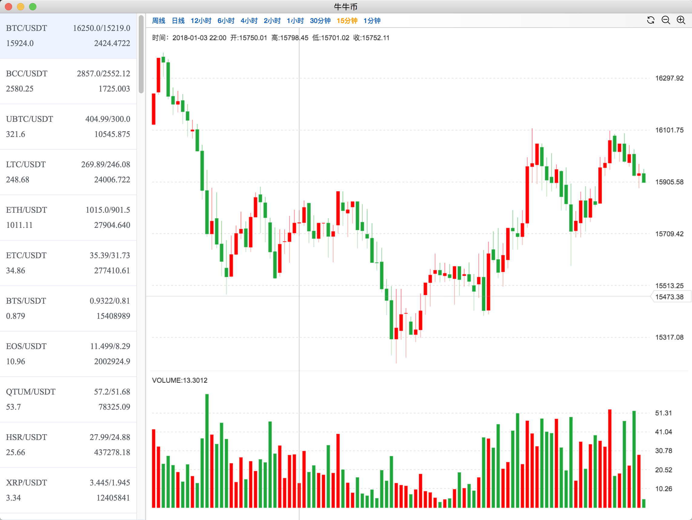

## Electron简介

[Electron](https://zh.wikipedia.org/wiki/Electron_(软件框架))（最初名为Atom Shell）是GitHub开发的一个开源框架。它允许使用Node.js（作为后端）和Chromium[^chromium]（作为前端）完成桌面GUI应用程序的开发。Electron现已被多个开源Web应用程序用于前端与后端的开发，著名项目包括GitHub的Atom和微软的Visual Studio Code。

Electron是一个由GitHub开发的开源库，通过将Chromium和Node.js组合并使用HTML，CSS和JavaScript进行构建Mac，Windows，和Linux跨平台桌面应用程序.

这不意味着 Electron 是绑定了 GUI 库的 JavaScript。相反，Electron 使用 web 页面作为它的 GUI，所以你可以把它看作成一个被 JavaScript 控制的，精简版的 Chromium 浏览器。


#### Chromium
- 枫树浏览器是一个基于Chromium的Windows/Linux浏览器。新增了部分功能，如鼠标手势，链接拖动及IE标签。（最后一次更新于2013-08-29，基带版本27.0.1453.110[11]）
- 世界之窗浏览器极速版（TheWorld Chrome版）
- 搜狗高速浏览器：基于Chromium开发，同时加入了IE内核引擎。
- 360浏览器极速版：基于Chromium开发，同时加入了IE内核引擎。
- 猎豹浏览器：基于Chromium开发，同时加入了IE内核引擎。
- 傲游浏览器：基于Chromium开发，同时加入了IE内核引擎。
- 七星浏览器：基于Chromium开发，同时加入了IE核心引擎。外观和枫树浏览器类似。
- QQ浏览器：基于Chromium开发，针对IE内核优化。
- 百度浏览器：基于Chromium开发。

#### [Node.js](http://nodejs.cn)

Node.js 是一个基于 Chrome V8 引擎的 JavaScript 运行环境。 

Node.js 使用了一个事件驱动、非阻塞式 I/O 的模型，使其轻量又高效。 

Node.js 的包管理器 npm，是全球最大的开源库生态系统。

#### 为什么选择 Electron

> Electron提供了一个Nodejs的运行时，专注于构建桌面应用，同时使用web页面来作为应用的GUI，你可以将其看作是一个由JavaScript控制的迷你版的Chromium浏览器。

够火（5w+ star）。Electron 的作者和 NW.js（原 node-webkit）是同一人，大家可以去知乎围观[维护一个大型开源项目是怎样的体验？](https://link.juejin.im/?target=https%3A%2F%2Fwww.zhihu.com%2Fquestion%2F36292298%2Fanswer%2F102418523)这个问题下作者的回答。[官方也有 Electron 和 NW.js 的对比](https://electronjs.org/docs/development/atom-shell-vs-node-webkit)

作者先是在Intel工作开发维护node-webkit（后改名NW.js），之后加入GitHub开发Atom编辑器，编写了一个新的桌面应用框架，当时的名称叫做atom-shell，之后开源，而后改名Electron

---

## Electron基础概念

#### 主进程和渲染进程

Electron 中，入口是一个 js 文件，运行这个入口文件（通常会是 package.json 里的 main 脚本）的进程称作主进程，在主进程使用 BrowserWindow 模块可以创建并管理 web 页面，也就是应用的 GUI。

```
const {BrowserWindow} = require('electron')
// 主进程创建web页面
let someWindow = new BrowserWindow(winOpts)
// 加载本地的文件
someWindow.loadURL('file://' + __dirname + '/index.html')
```

在主进程创建的一个个web页面也都运行着自己的进程，即渲染进程，渲染进程各自独立，各自管理自己的页面，可以想象是浏览器一个个的 tab。

- 主进程
	- 整体控制
	- 全局快捷键
	- 屏幕
	- 窗口
	- 菜单项
	- 系统托盘
	- 从主进程到渲染进程的异步通信
	- 创建和控制视图
	- 等等

- 渲染进程
	- 页面渲染
	- <webview> webview标签
	- 渲染进程与主进程通信
	- 从渲染进程到主进程的异步通信
	- 子窗口
	- 捕获桌面资源
	
#### 进程间通信

Web 页面因为安全限制，不能直接访问原生的GUI资源（比如dialog、电源监控），Electron 中也是一样，渲染进程如果想要进行原生的GUI操作，就必须和主进程通讯，请求相应的GUI操作

- ipcMain和ipcRenderer

	```
	// 渲染进程中
	const {ipcRenderer} = require('electron')
	ipcRender.send('somemsg', data);
	ipcRender.on('replaymsg', (evt, otherData) => {
	    console.log(otherData)
	})
	// 主进程中
	const {ipcMain} = require('electron')
	ipcMain.on('somemsg', (evt, data) => {
	    console.log(data)
	    evt.sender.send('replymsg', otherData);
	});
	```

- 直接在渲染进程使用remote模块，remote 模块可以直接获取主进程中的模块。这种方式其实是第一种方式的简化。

	```
	// 在渲染进程打开提示对话框
	const {dialog} = require('electron').remote
	dialog.showMessageBox({ opts });
	```

- 主进程向渲染进程发送消息

	```
	this.webviewWindow.webContents.send('ping');
	```
	
- 渲染进程之间的通信

	如果数据不需要实时性，只是渲染进程之间数据的共享，那么使用官方的建议即可：[How to share data between web pages?](https://link.juejin.im/?target=http%3A%2F%2Felectron.atom.io%2Fdocs%2Ffaq%2F%23how-to-share-data-between-web-pages)。如果要求实时性，需要配合前几种种方式实现。
	
	```
	// 主进程
	// 两个窗口互相获取对方的窗口 id, 并发送给渲染进程
	win1.webContents.send('distributeIds',{
	    win2Id : win2.id
	});
	win2.webContents.send('distributeIds',{
	    win1Id : win1.id
	});
	// 渲染进程
	// 通过 id 得到窗口
	remote.BrowserWindow.fromId(win2Id).webContents.send('someMsg', 'someThing');	
	```

- Vue event bus

	**src/renderer/bus.js**

	```
	import Vue from 'vue'

	export default new Vue()
	```
	
	**src/renderer/tray.js**

	```
	import bus from './bus'
	import { remote } from 'electron'
	
	const tray = new remote.Tray(remote.clipboard.readImage())
	const menu = remote.Menu.buildFromTemplate([
	  {
	    label: 'ping',
	    click () {
	      // Send event to Vue
	      bus.$emit('ping')
	    }
	  }
	])
	
	tray.setToolTip('hello world')
	tray.setContextMenu(menu)
	```

	**SomeComponent.vue**

	```
	import bus from '@/bus'
	/* ... */
	  mounted () {
	    bus.$on('ping', () => {
	      // event logic
	      console.log('pong')
	    })
	  }
	/* ... */
	```

#### 简要总结下 Electron 的优缺点：

优点：

- 可以用 Web 前端技术开发跨平台的桌面客户端
- 可以从 Node 的生态获得极大的助力
- 文档丰富，社区活跃

缺点：

- 包大，因为集成了 chromium
- 不支持xp

---

## Electron Quick Start

```
git clone https://github.com/electron/electron-quick-start
cd electron-quick-start
npm install
npm start
```

#### 打包发布

- mac

	```
	electron-packager ./ --platform=mas --arch=x64
	```

---

## Electron & Vue全家桶 快速搭建

```
# 安装 vue-cli 和 脚手架样板代码
npm install -g vue-cli
vue init simulatedgreg/electron-vue my-project

# 安装依赖并运行你的程序
cd my-project
yarn # 或者 npm install
yarn run dev # 或者 npm run dev
```
[vue-electron模板](https://github.com/SimulatedGREG/electron-vue/tree/master/docs/cn)

---

## 技术栈
	
### Vue

Vue (读音 /vjuː/，类似于 view) 是一套用于构建用户界面的渐进式框架。与其它大型框架不同的是，Vue 被设计为可以自底向上逐层应用。Vue 的核心库只关注视图层，不仅易于上手，还便于与第三方库或既有项目整合。另一方面，当与现代化的工具链以及各种[支持类库](https://github.com/vuejs/awesome-vue#libraries--plugins)结合使用时，Vue 也完全能够为复杂的单页应用提供驱动。

- **生命周期图示**

	

### vuex

Vuex 是一个专为 Vue.js 应用程序开发的状态管理模式。它采用集中式存储管理应用的所有组件的状态，并以相应的规则保证状态以一种可预测的方式发生变化。Vuex 也集成到 Vue 的官方调试工具 devtools extension，提供了诸如零配置的 time-travel 调试、状态快照导入导出等高级调试功能。
 
### axios

axios 是一个基于Promise 用于浏览器和 nodejs 的 HTTP 客户端 

---

## Demo演示

运用Electron和一些开源Api做了一个简单的demo，可以查看币市行情，体验堪比原生般顺滑。



## 参考资料
- [Electron中文文档](https://github.com/amhoho/electron-cn-docs)
- [Electron Api](https://electronjs.org/docs/api)
- [vuejs 单文件组件.vue 文件](http://www.cnblogs.com/SamWeb/p/6391373.html)
- [es2015/es6](http://es6.ruanyifeng.com/#README)
- Vue全家桶
	- [vue](https://vuefe.cn/v2/guide/index.html)
	- [vuex](https://vuex.vuejs.org/zh-cn/state.html)
	- [vue-router](https://router.vuejs.org/zh-cn/essentials/getting-started.html)
	- [axios](https://ykloveyxk.github.io/2017/02/25/axios全攻略/)
- 组件库
	- [element-ui](http://element-cn.eleme.io/#/zh-CN/component/quickstart)
	- [vue-carbon(可选)](http://www.myronliu.com/vue-carbon/book/v0.5.0/css/list.html)
- [node-gyp](https://github.com/nodejs/node-gyp) 
- [Node.js C++扩展开发](https://nodejs.org/api/addons.html)

### 备注

[^chromium]: [Chromium](https://zh.wikipedia.org/wiki/Chromium)是一个由Google主导开发的网页浏览器，以BSD许可证等多重自由版权发行并开放源代码。是Google为发展自家的浏览器Google Chrome而打开的项目，所以Chromium相当于Google Chrome的工程版或实验版（尽管Google Chrome本身也有β版），新功能会率先在Chromium上开放，待验证后才会应用在Google Chrome上，故Google Chrome的功能会相对落后但较稳定。