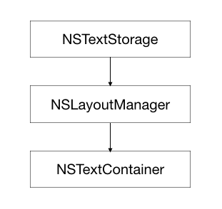
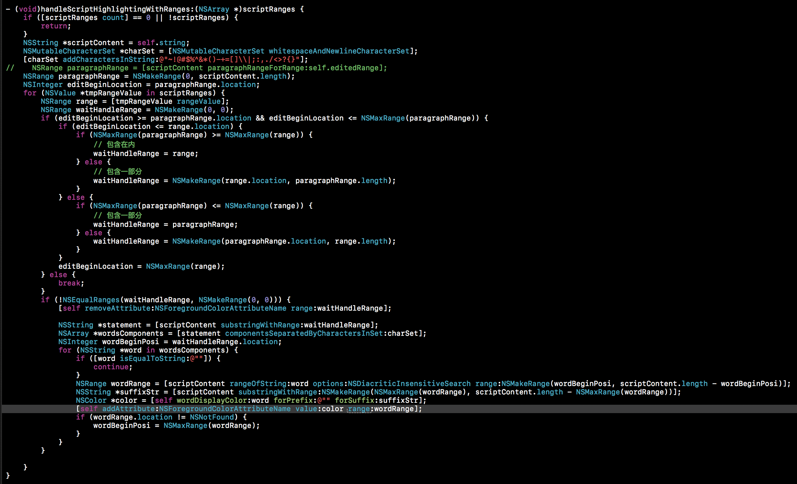
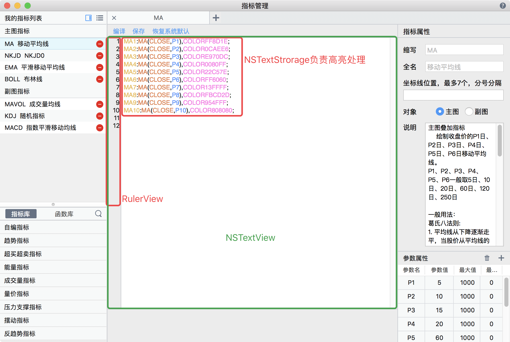

Mac 实现指标语法高亮文本编辑器

---

### 语法高亮简介

Cocoa AppKit 提供了一个叫做NSTextStorage的类，可以实现高亮功能，这是它的结构



先暂且不谈这个结构，我们看一下NSTextView提供的一个构造接口：

```
- (instancetype)initWithFrame:(NSRect)frameRect textContainer:(nullable NSTextContainer *)container;
```

NSTextView 除了我们常见的构造方法外，还提供了一个这样的构造方法，它接受一个 NSTextContainer 类型的参数。 再看看我们上面那张图中的 NSTextContainer， 稍微建立起一点关系了。

如果以 MVC 的思路来思考的话:

* NSTextStorage 相当于模型层，用于管理文本的底层存储，以及如何定义文本显示的样式。 高亮显示功能的主要代码都是在这个类中完成的。

* NSLayoutManager 相当于控制器层，它负责把 NSTextStorage 的文本内容绘制到相应的视图上，并且它还负责文字的排版处理等。

* NSTextContainer 定义了文本在 NSTextView 上面的显示区域。

基于这些分层的概念，我们可以把同一个 NSTextStorage 同时显示到两个不同的视图上面。


--

### 重写 NSTextStorage

首先实现一个继承自 NSTextStorage 的类：

``` Objective-C
@interface FTCIndicatorHighlightingTextStorage : NSTextStorage

@end

```
定义一个 NSMutableAttributedString 类型的属性，它用于我们的底层存储，然后实现几个约定的 getter 和 setter 方法，对_imp对象相应方法的一个包装：

```
@implementation FTCIndicatorHighlightingTextStorage  {
    NSMutableAttributedString *_imp;
}

- (instancetype)init {
    if (self = [super init]) {
        _imp = [NSMutableAttributedString new];
    }
    return self;
}

#pragma mark - Reading Text

- (NSString *)string {
    return _imp.string;
}

- (NSDictionary<NSString *,id> *)attributesAtIndex:(NSUInteger)location effectiveRange:(NSRangePointer)range {
    return [_imp attributesAtIndex:location effectiveRange:range];
}

#pragma mark - Text Editing

- (void)replaceCharactersInRange:(NSRange)range withString:(NSString *)str {
    [_imp replaceCharactersInRange:range withString:[str uppercaseString]];
    [self edited:NSTextStorageEditedCharacters range:range changeInLength:(NSInteger)str.length - (NSInteger)range.length];
}

- (void)setAttributes:(NSDictionary<NSString *,id> *)attrs range:(NSRange)range {
    [_imp setAttributes:attrs range:range];
    [self edited:NSTextStorageEditedAttributes range:range changeInLength:0];
}

@end

```

接下来，我们实现最关键的方法 processEditing, 这个方法会在 NSTextView 的文本被更改的时候被调用，我们可以在这里匹配出要进行高亮的关键字：

```
- (void)processEditing {
   	[super processEditing];
	// 这里根据需要使用正则匹配对需要被高亮的文本做处理，具体可参考下图指标高亮处理逻辑的代码示例
	// 对需要被高亮的文本设置相应的属性
	// [self addAttribute:NSForegroundColorAttributeName value:color range:wordRange];
}
```

指标编辑支持代码注释，scriptRanges为第一次正则匹配后去掉所有注释代码后，有效代码的Range集合




--

### 重写 NSLayoutManager

为了尽量封装，对外使用更加便捷，我们这里重写NSLayoutManager，将NSTextStorage直接与NSLayoutManager关联起来。当然也可以在外部手动关联。废话少说，直接代码：

``` Objective-C
@interface FTCIndicatorHighlightingTSLayoutManager : NSLayoutManager

@property (nonatomic, strong) FTCIndicatorHighlightingTextStorage *scriptTextStorage;

@end

@implementation FTCIndicatorHighlightingTSLayoutManager

- (instancetype)init {
    if (self = [super init]) {
        _scriptTextStorage = [FTCIndicatorHighlightingTextStorage new];
        [_scriptTextStorage addLayoutManager:self];
        self.delegate = self;
    }
    return self;
}

@end

```

-- 

### 重写 NSTextView

实际需求中，代码编辑器需要在左侧支持行号显示，为了代码结构上更加紧凑，我们重写了NSTextView，使用运行时的方式关联了一个NSRulerView，以下为重写的NSTextView：

```
// --- FTCIndicatorTextView.h

@interface FTCIndicatorTextView : NSTextView

@end


@interface NSTextView (FTCLineNumTextView)

- (void)lnv_setUpLineNumberView;

@end

// --- FTCIndicatorTextView.m

@implementation FTCIndicatorTextView

@end

@interface NSTextView()

@property (nonatomic, strong) FTCIndicatorLineNumberRulerView *lineNumberView;

@end

@implementation NSTextView (FTCLineNumTextView)
- (void)dealloc {
    [[NSNotificationCenter defaultCenter] removeObserver:self];
}

- (FTCIndicatorLineNumberRulerView *)lineNumberView {
    return objc_getAssociatedObject(self, _cmd);
}

- (void)setLineNumberView:(FTCIndicatorLineNumberRulerView *)lineNumberView {
    objc_setAssociatedObject(self, @selector(lineNumberView), lineNumberView, OBJC_ASSOCIATION_RETAIN_NONATOMIC);
}

- (void)lnv_setUpLineNumberView {
    if (!self.font) {
        self.font = [NSFont systemFontOfSize:[NSFont smallSystemFontSize]];
    }
    self.lineNumberView = [[FTCIndicatorLineNumberRulerView alloc] initWithTextView:self];
    
    NSScrollView *scrollView = self.enclosingScrollView;
    scrollView.verticalRulerView = self.lineNumberView;
    scrollView.hasVerticalRuler = YES;
    scrollView.rulersVisible = YES;
    
    self.postsFrameChangedNotifications = YES;
    [[NSNotificationCenter defaultCenter] addObserver:self selector:@selector(lnv_frameDidChange:) name:NSViewFrameDidChangeNotification object:self];
    [[NSNotificationCenter defaultCenter] addObserver:self selector:@selector(lnv_textDidChange:) name:NSTextDidChangeNotification object:self];
}

- (void)lnv_frameDidChange:(NSNotification *)notify {
    [self.lineNumberView setNeedsDisplay:YES];
}

- (void)lnv_textDidChange:(NSNotification *)notify {
    [self.lineNumberView setNeedsDisplay:YES];
}

@end

```

此处再贴一下FTCIndicatorLineNumberRulerView的核心实现，这个负责行号如何绘制：

```
// FTCIndicatorLineNumberRulerView.h

@interface FTCIndicatorLineNumberRulerView : NSRulerView

- (instancetype)initWithTextView:(NSTextView *)textView;

@end

// FTCIndicatorLineNumberRulerView.m

@implementation FTCIndicatorLineNumberRulerView

- (instancetype)initWithTextView:(NSTextView *)textView {
    self = [super initWithScrollView:textView.enclosingScrollView orientation:NSVerticalRuler];
    if (self) {
        self.font = textView.font ? textView.font : [NSFont systemFontOfSize:[NSFont smallSystemFontSize]];
        self.clientView = textView;
        self.ruleThickness = 27;
    }
    return self;
}

- (void)drawLineNumber:(NSString *)numStr y:(CGFloat)y relativePoint:(NSPoint)relaPoint{
    NSAttributedString *aString = [[NSAttributedString alloc] initWithString:numStr attributes:self.attribute];
    CGFloat x = 24 - aString.size.width;
    [aString drawAtPoint:NSMakePoint(x, y + relaPoint.y - 2)];
}

- (void)drawHashMarksAndLabelsInRect:(NSRect)rect {
    NSRect divideLineRect = rect;
    divideLineRect.origin.x = rect.size.width - 1;
    divideLineRect.size.width = 1;
    [[FTCTheme defaultTheme].borderLineColor set];
    NSRectFill(divideLineRect);
    
    NSTextView *textView = (NSTextView *)self.clientView;
    if ([textView isKindOfClass:[NSTextView class]]) {
        NSLayoutManager *layoutManager = textView.layoutManager;
        NSPoint relativePoint = [self convertPoint:NSZeroPoint fromView:textView];
        
        NSRange visibleGlyphRange = [layoutManager glyphRangeForBoundingRect:textView.visibleRect inTextContainer:textView.textContainer];
        NSInteger firstVisibleGlyphCharacterIndex = [layoutManager characterIndexForGlyphAtIndex:visibleGlyphRange.location];
        NSRegularExpression *newLineRegex = [NSRegularExpression regularExpressionWithPattern:@"\n" options:NSRegularExpressionCaseInsensitive error:nil];
        NSInteger lineNumber = [newLineRegex numberOfMatchesInString:textView.string options:NSMatchingReportProgress range:NSMakeRange(0, firstVisibleGlyphCharacterIndex)] + 1;
        NSInteger glyphIndexForStringLine = visibleGlyphRange.location;
        while (glyphIndexForStringLine < NSMaxRange(visibleGlyphRange)) {
            NSRange charactorRangeForStringLine = [textView.string lineRangeForRange:NSMakeRange([layoutManager characterIndexForGlyphAtIndex:glyphIndexForStringLine], 0)];
            NSRange glyphRangeForStringLine = [layoutManager glyphRangeForCharacterRange:charactorRangeForStringLine actualCharacterRange:nil];
            NSInteger glyphIndexForGlyphLine = glyphIndexForStringLine;
            NSInteger glyphLineCount = 0;
            
            while (glyphIndexForGlyphLine < NSMaxRange(glyphRangeForStringLine)) {
                NSRange effectiveRange = NSMakeRange(0, 0);
                NSRect lineRect = [layoutManager lineFragmentRectForGlyphAtIndex:glyphIndexForGlyphLine effectiveRange:&effectiveRange];
                if (glyphLineCount > 0) {
                    [self drawLineNumber:@"" y:NSMinY(lineRect) relativePoint:relativePoint];
                } else {
                    [self drawLineNumber:[NSString stringWithFormat:@"%ld", lineNumber] y:NSMinY(lineRect) relativePoint:relativePoint];
                }
                glyphLineCount++;
                glyphIndexForGlyphLine = NSMaxRange(effectiveRange);
            }
            glyphIndexForStringLine = NSMaxRange(glyphRangeForStringLine);
            lineNumber++;
        }
        if ([layoutManager extraLineFragmentTextContainer]) {
            [self drawLineNumber:[NSString stringWithFormat:@"%ld", lineNumber] y:NSMinY(layoutManager.extraLineFragmentRect) relativePoint:relativePoint];
        }
    }
}

```

--

### 设置 NSTextView
以上我们完成了 NSTextStorage/NSTextView/NSLayoutManager 子类的实现，现在我们就可以用它来构建语法高亮编辑器了：

```
@interface FTCIndicatorScriptEditViewController : NSViewController

@end

@implementation FTCIndicatorScriptEditViewController

/*... 此处省略若干代码 ...*/

- (void)setupContentTextView {    
    NSRect frame = self.rightEdgeContainerView.frame;
    
    NSScrollView *scrollview = [[NSScrollView alloc] initWithFrame:NSMakeRect(0, 0, frame.size.width, frame.size.height)];
    [scrollview setBorderType:NSNoBorder];
    [scrollview setHasVerticalScroller:YES];
    [scrollview setHasHorizontalScroller:NO];
    [self.rightEdgeContainerView addSubview:scrollview];
    [scrollview setAutoresizingMask:NSViewWidthSizable | NSViewHeightSizable];
    
    NSSize contentSize = [scrollview contentSize];
    NSTextContainer *textContainer = [[NSTextContainer alloc] initWithContainerSize:contentSize];
    FTCIndicatorTextView *contentText = [[FTCIndicatorTextView alloc] initWithFrame:NSMakeRect(0, 0, contentSize.width, contentSize.height) textContainer:textContainer];
    [contentText setMinSize:NSMakeSize(0.0, contentSize.height)];
    [contentText setMaxSize:NSMakeSize(FLT_MAX, FLT_MAX)];
    [contentText setVerticallyResizable:YES];
    [contentText setHorizontallyResizable:NO];
    [contentText setAutoresizingMask:NSViewWidthSizable];
    [[contentText textContainer] setContainerSize:NSMakeSize(contentSize.width, FLT_MAX)];
    [[contentText textContainer] setWidthTracksTextView:YES];
    [scrollview setDocumentView:contentText];

    [self.scriptTSLayoutManager addTextContainer:textContainer];
    contentText.font = [FTCTheme defaultTheme].textDefaultFont;
    [contentText lnv_setUpLineNumberView];
    contentText.allowsUndo = YES;
    _contentText = contentText;
}
/*... 此处省略若干代码 ...*/

@end

```

至此对此文开头的第一张贴图，会有一个更加清晰的认识。

再贴一张最终实现的效果图：


