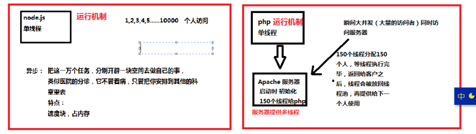
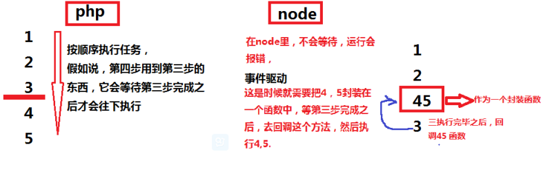

## Node.js

* Node.js 是一个基于 Chrome V8 引擎的 JavaScript 运行环境。 
* Node.js 使用了一个事件驱动、非阻塞式 I/O 的模型，使其轻量又高效。 
* Node.js 的包管理器 npm，是全球最大的开源库生态系统。


## PHP vs Node.js

### 发展状况

* PHP
	
	Rasmus Lerdorf在1994年创造出了PHP。它是由安装在web服务器（Apache、Ngix）上的组件运行的。
	
	PHP代码可以和HTML混合到一块。 对于初学者就能很快写出很有价值的代码，这并不需要太多的练习。 这让PHP变得越来越流行, 现在全球百分之八十的服务器上都在运行着PHP。全球四分之一的网站都在用的一个内容管理系统--WordPress，就是用PHP写的。

* Node.js
	
	Ryan Dahl在2009年创造了Node.js。它是基于Google的V8 JavaScript解释引擎（在Chrome浏览器里它负责执行客户端的JavaScript代码）。与其它语言不同的是Node.js内置了处理网络请求和响应的函数库，所以你不需要单独的服务器（Apache、Ngix）或者其他依赖。 

Node.js虽然很新但是很快就获得了极大的追捧。在很多的大公司都有在使用，例如：Microsoft，Yahoo，LinkedIn和PayPal。

### 运行机制对比

1. Node.js 他用的是JavaScript引擎，那么注定它是单线程 ，使用异步方法开辟多个任务，无需像php等待上个任务线程使用结束之后给下个使用，

	PHP也是单线程但是它借用Apache服务器提供多线程服务

	


2. 高并发，大数据量怎么处理：

	php ： 优化sql ，用组件，用缓存，为了让线程尽快结束，进行下一次任务

	node：单线程 、异步、事件驱动

	下面是他们处理事件:
	
	- php上下衔接依次执行；

	- Node.js中因为运行速度很快并不会等待，所以如果后面用到前面返回的结果，就需要把后面的封装起来，作为一个回调函数执行；　　
　　


**优点：**

- 性能高(运行机制问题)
- 开发效率高（省不少优化的事）
- 应用范围广（可以开发桌面系统，electron框架）

**缺点：**

- 新、人少
- 中间件少
- IDE不完善

### Node.js的劣势和解决方案　　
1. 默认不支持多核，但可以用cluster解决
2. 默认不支持服务器集群，node-http-proxy可以解决
3. 使用nginx做负载均衡，静态的由nginx处理，动态的有node.js处理
4. forever或node-cluster实现灾难恢复

----

## Node.js 快速搭建Http服务

```
var http = require('http');

http.createServer(function (request, response) {

	// 发送 HTTP 头部 
	// HTTP 状态值: 200 : OK
	// 内容类型: text/plain
	response.writeHead(200, {'Content-Type': 'text/plain'});

	// 发送响应数据 "Hello World"
	response.end('Hello World\n');
}).listen(8888);

// 终端打印如下信息
console.log('Server running at http://127.0.0.1:8888/');

```

以上代码我们完成了一个可以工作的 HTTP 服务器。
使用 node 命令执行以上的代码：

```
node server.js
Server running at http://127.0.0.1:8888/

```

## Express

<!--高度包容、快速而极简的 Node.js Web 框架-->

Express 是一个简洁而灵活的 Node.js Web应用框架, 提供了一系列强大特性帮助你创建各种 Web 应用，和丰富的 HTTP 工具。

使用 Express 可以快速地搭建一个完整功能的网站。

Express 框架核心特性：

- 可以设置中间件来响应 HTTP 请求。
- 定义了路由表用于执行不同的 HTTP 请求动作。
- 可以通过向模板传递参数来动态渲染 HTML 页面。

### 安装

假设您已经安装了 Node.js，创建目录以保存应用程序，并将其设置为工作目录。

```
$ mkdir myapp
$ cd myapp
```

使用 npm init 命令为应用程序创建 package.json 文件。 有关 package.json 工作方式的更多信息，请参阅 Specifics of npm’s package.json handling。

```
$ npm init
```

此命令提示您输入若干项，例如应用程序的名称和版本。 现在，只需按回车键以接受其中大多数项的缺省值，但以下情况例外：

```
entry point: (index.js)
```

输入 app.js，或者您希望使用的任何主文件名称。如果希望文件名为 index.js，请按回车键以接受建议的缺省文件名。

在 app 目录中安装 Express，然后将其保存在依赖项列表中。例如：

```
$ npm install express --save
```

要暂时安装 Express 而不将其添加到依赖项列表中，请省略 --save 选项：

```
$ npm install express
```

采用 --save 选项安装的 Node 模块已添加到 package.json 文件中的 dependencies 列表。 今后运行 app 目录中的 npm install 将自动安装依赖项列表中的模块。

---

### Express 应用程序生成器

可使用应用程序生成器工具 (express) 快速创建应用程序框架。

使用以下命令安装 express：

```
$ npm install express-generator -g
```

使用 -h 选项显示命令选项：

```
$ express -h

  Usage: express [options][dir]

  Options:

    -h, --help          output usage information
        --version       output the version number
    -e, --ejs           add ejs engine support
        --hbs           add handlebars engine support
        --pug           add pug engine support
    -H, --hogan         add hogan.js engine support
    -v, --view <engine> add view <engine> support (ejs|hbs|hjs|jade|pug|twig|vash) (defaults to jade)
    -c, --css <engine>  add stylesheet <engine> support (less|stylus|compass|sass) (defaults to plain css)
        --git           add .gitignore
    -f, --force         force on non-empty directory

```

例如，以下语句在当前工作目录中创建名为 myapp 的 Express 应用程序：

```
$ express --view=pug myapp

   create : myapp
   create : myapp/package.json
   create : myapp/app.js
   create : myapp/public
   create : myapp/public/javascripts
   create : myapp/public/images
   create : myapp/routes
   create : myapp/routes/index.js
   create : myapp/routes/users.js
   create : myapp/public/stylesheets
   create : myapp/public/stylesheets/style.css
   create : myapp/views
   create : myapp/views/index.pug
   create : myapp/views/layout.pug
   create : myapp/views/error.pug
   create : myapp/bin
   create : myapp/bin/www
```

然后安装依赖项：

```
$ cd myapp
$ npm install
```

在 MacOS 或 Linux 上，采用以下命令运行此应用程序：

```
$ DEBUG=myapp:* npm start
```

在 Windows 上，使用以下命令：

```
> set DEBUG=myapp:* & npm start
```

然后在浏览器中装入 http://localhost:3000/ 以访问此应用程序。

生成的应用程序具有以下目录结构：

```
.
├── app.js
├── bin
│   └── www
├── package.json
├── public
│   ├── images
│   ├── javascripts
│   └── stylesheets
│       └── style.css
├── routes
│   ├── index.js
│   └── users.js
└── views
    ├── error.pug
    ├── index.pug
    └── layout.pug

7 directories, 9 files
```

---

### 路由
路由用于确定应用程序如何响应对特定端点的客户机请求，包含一个 URI（或路径）和一个特定的 HTTP 请求方法（GET、POST 等）。

每个路由可以具有一个或多个处理程序函数，这些函数在路由匹配时执行。

路由定义采用以下结构：


`app.METHOD(PATH, HANDLER)`

其中：

- app 是 express 的实例。
- METHOD 是 HTTP 请求方法。
- PATH 是服务器上的路径。
- HANDLER 是在路由匹配时执行的函数。

本教程假定创建了名为 app 的 express 实例且服务器正在运行。如果您对创建和启动应用程序并不熟悉，请参阅 Hello world 示例。
以下示例演示了如何定义简单路由。

以主页上的 Hello World! 进行响应：

```
app.get('/', function (req, res) {
  res.send('Hello World!');
});
```

在根路由 (/) 上（应用程序的主页）对 POST 请求进行响应：

```
app.post('/', function (req, res) {
  res.send('Got a POST request');
});
```

对 /user 路由的 PUT 请求进行响应：

```
app.put('/user', function (req, res) {
  res.send('Got a PUT request at /user');
});
```

对 /user 路由的 DELETE 请求进行响应：

```
app.delete('/user', function (req, res) {
  res.send('Got a DELETE request at /user');
});
```

以下是基于字符串模式的路由路径的一些示例。

此路由路径将匹配 acd 和 abcd。

```
app.get('/ab?cd', function(req, res) {
  res.send('ab?cd');
});
```
此路由路径将匹配 abcd、abbcd、abbbcd 等。

```
app.get('/ab+cd', function(req, res) {
  res.send('ab+cd');
});
```
此路由路径将匹配 abcd、abxcd、abRABDOMcd、ab123cd 等。

```
app.get('/ab*cd', function(req, res) {
  res.send('ab*cd');
});
```
此路由路径将匹配 /abe 和 /abcde。

```
app.get('/ab(cd)?e', function(req, res) {
 res.send('ab(cd)?e');
});
```
字符` ?、+、* 和 () `是其正则表达式同应项的子集。基于字符串的路径按字面理解连字符 (-) 和点 (.)。
基于正则表达式的路由路径的示例：

此路由路径将匹配名称中具有“a”的所有路由。

```
app.get(/a/, function(req, res) {
  res.send('/a/');
});
```
此路由路径将匹配 butterfly 和 dragonfly，但是不匹配 butterflyman、dragonfly man 等。

```
app.get(/.*fly$/, function(req, res) {
  res.send('/.*fly$/');
});
```
路由处理程序
您可以提供多个回调函数，以类似于中间件的行为方式来处理请求。唯一例外是这些回调函数可能调用 next('route') 来绕过剩余的路由回调。您可以使用此机制对路由施加先决条件，在没有理由继续执行当前路由的情况下，可将控制权传递给后续路由。

路由处理程序的形式可以是一个函数、一组函数或者两者的结合，如以下示例中所示。

单个回调函数可以处理一个路由。例如：

```
app.get('/example/a', function (req, res) {
  res.send('Hello from A!');
});
```
多个回调函数可以处理一个路由（确保您指定 next 对象）。例如：

```
app.get('/example/b', function (req, res, next) {
  console.log('the response will be sent by the next function ...');
  next();
}, function (req, res) {
  res.send('Hello from B!');
});
```
一组回调函数可以处理一个路由。例如：

```
var cb0 = function (req, res, next) {
  console.log('CB0');
  next();
}

var cb1 = function (req, res, next) {
  console.log('CB1');
  next();
}

var cb2 = function (req, res) {
  res.send('Hello from C!');
}

app.get('/example/c', [cb0, cb1, cb2]);
```
独立函数与一组函数的组合可以处理一个路由。例如：

```
var cb0 = function (req, res, next) {
  console.log('CB0');
  next();
}

var cb1 = function (req, res, next) {
  console.log('CB1');
  next();
}

app.get('/example/d', [cb0, cb1], function (req, res, next) {
  console.log('the response will be sent by the next function ...');
  next();
}, function (req, res) {
  res.send('Hello from D!');
});
```
**响应方法**

下表中响应对象 (res) 的方法可以向客户机发送响应，并终止请求/响应循环。如果没有从路由处理程序调用其中任何方法，客户机请求将保持挂起状态。


| 方法 | 描述 |
------------- | -------------
res.download() | 提示将要下载文件。
res.end() | 结束响应进程。
res.json() | 发送 JSON 响应。
res.jsonp() | 在 JSONP 的支持下发送 JSON 响应。
res.redirect() | 重定向请求。
res.render() | 呈现视图模板。
res.send() | 发送各种类型的响应。
res.sendFile | 以八位元流形式发送文件。
res.sendStatus() | 设置响应状态码并以响应主体形式发送其字符串表示。

### app.route()  

您可以使用 app.route() 为路由路径创建可链接的路由处理程序。 因为在单一位置指定路径，所以可以减少冗余和输入错误。有关路由的更多信息，请参阅 Router() 文档。

以下是使用 app.route() 定义的链式路由处理程序的示例。

```
app.route('/book')
  .get(function(req, res) {
    res.send('Get a random book');
  })
  .post(function(req, res) {
    res.send('Add a book');
  })
  .put(function(req, res) {
    res.send('Update the book');
  });
```

### express.Router
使用 express.Router 类来创建可安装的模块化路由处理程序。Router 实例是完整的中间件和路由系统；因此，常常将其称为“微型应用程序”。

以下示例将路由器创建为模块，在其中装入中间件，定义一些路由，然后安装在主应用程序的路径中。

在应用程序目录中创建名为 birds.js 的路由器文件，其中包含以下内容：

```
var express = require('express');
var router = express.Router();

// middleware that is specific to this router
router.use(function timeLog(req, res, next) {
  console.log('Time: ', Date.now());
  next();
});
// define the home page route
router.get('/', function(req, res) {
  res.send('Birds home page');
});
// define the about route
router.get('/about', function(req, res) {
  res.send('About birds');
});

module.exports = router;
```
接着，在应用程序中装入路由器模块：

```
var birds = require('./birds');
...
app.use('/birds', birds);
```
此应用程序现在可处理针对 /birds 和 /birds/about 的请求，调用特定于此路由的 timeLog 中间件函数。

---

### 使用中间件

**中间件 (middleware)**

在最终请求处理程序之前由 Express 路由层调用的函数，因此位于原始请求与最终期望的路由之间的中间位置。有关中间件的术语有几点说明：

- 调用 `var foo = require('middleware');`需要或使用 Node.js 模块。随后 `var mw = foo()` 语句通常返回中间件。
- 调用 `app.use(mw);`将中间件添加到全局处理堆栈。
- 调用 `app.get('/foo', mw, function (req, res) { ... });`将中间件添加到“GET /foo”处理堆栈。

Express 是一个路由和中间件 Web 框架，其自身只具有最低程度的功能：Express 应用程序基本上是一系列中间件函数调用。

中间件函数能够访问[请求对象](http://expressjs.com/zh-cn/4x/api.html#req) (req)、[响应对象](http://expressjs.com/zh-cn/4x/api.html#res) (res) 以及应用程序的请求/响应循环中的下一个中间件函数。下一个中间件函数通常由名为 next 的变量来表示。

**中间件函数可以执行以下任务：**

- 执行任何代码。
- 对请求和响应对象进行更改。
- 结束请求/响应循环。
- 调用堆栈中的下一个中间件函数。

如果当前中间件函数没有结束请求/响应循环，那么它必须调用 next()，以将控制权传递给下一个中间件函数。否则，请求将保持挂起状态。

**Express 应用程序可以使用以下类型的中间件：**

- [应用层中间件](http://expressjs.com/zh-cn/guide/using-middleware.html#middleware.application)
- [路由器层中间件](http://expressjs.com/zh-cn/guide/using-middleware.html#middleware.router)
- [错误处理中间件](http://expressjs.com/zh-cn/guide/using-middleware.html#middleware.error-handling)
- [内置中间件](http://expressjs.com/zh-cn/guide/using-middleware.html#middleware.built-in)
- [第三方中间件](http://expressjs.com/zh-cn/guide/using-middleware.html#middleware.third-party)

---

### 将模板引擎用于 Express

在 Express 可以呈现模板文件之前，必须设置以下应用程序设置：

views：模板文件所在目录。例如：`app.set('views', './views')`
view engine：要使用的模板引擎。例如：`app.set('view engine', 'jade')`
然后安装对应的模板引擎 npm 包：

```
$ npm install jade --save
```

---

### 数据库集成

---

### MySQL

#### 安装驱动

```
$ npm install mysql
```

#### 连接数据库

在以下实例中修改根据你的实际配置修改数据库用户名、及密码及数据库名：

`test.js` 文件代码：

```
var mysql      = require('mysql');
var connection = mysql.createConnection({
  host     : 'localhost',
  user     : 'root',
  password : '123456',
  database : 'test'
});
 
connection.connect();
 
connection.query('SELECT 1 + 1 AS solution', function (error, results, fields) {
  if (error) throw error;
  console.log('The solution is: ', results[0].solution);
});
```

执行以下命令输出就结果为：

```
$ node test.js
The solution is: 2
```
---

### [MongoDB](http://www.runoob.com/mongodb/mongodb-tutorial.html)
MongoDB 是由C++语言编写的，是一个基于分布式文件存储的开源数据库系统。
在高负载的情况下，添加更多的节点，可以保证服务器性能。

MongoDB 旨在为WEB应用提供可扩展的高性能数据存储解决方案。

MongoDB 将数据存储为一个文档，数据结构由键值(key=>value)对组成。MongoDB 文档类似于 JSON 对象。字段值可以包含其他文档，数组及文档数组。


模块：mongodb 安装

```
$ npm install mongodb
```

示例

```
var MongoClient = require('mongodb').MongoClient;

MongoClient.connect('mongodb://localhost:27017/animals', function(err, db) {
  if (err) {
    throw err;
  }
  db.collection('mammals').find().toArray(function(err, result) {
    if (err) {
      throw err;
    }
    console.log(result);
  });
});
```

如果您需要 MongoDB 的对象模型驱动程序，请查看 [Mongoose](https://github.com/LearnBoost/mongoose)。


-----

### 参考资料

- [Express 中文网](http://expressjs.com/zh-cn/)
- [Node.js Express 框架](http://www.runoob.com/nodejs/nodejs-express-framework.html)