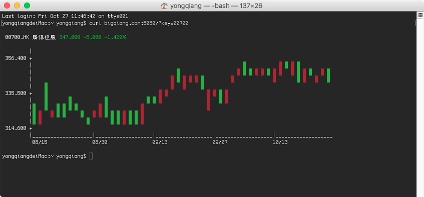
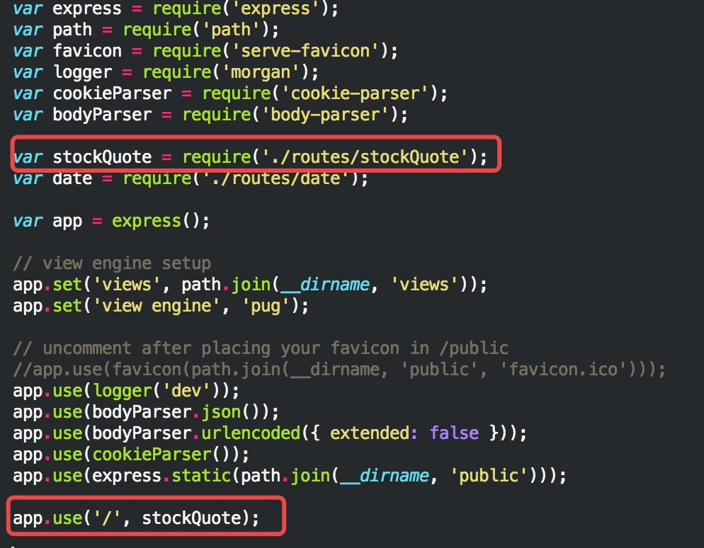
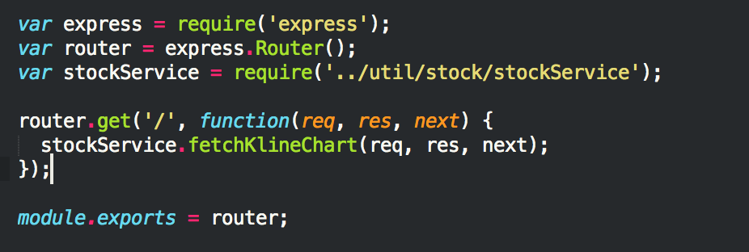
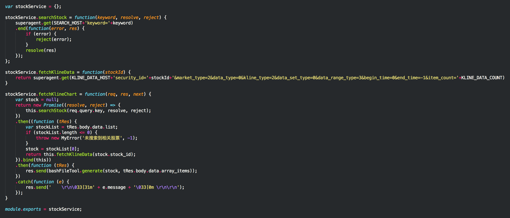

基于之前的一篇文章[Node.js+express快速入门](http://bigqiang.com/?p=351)，本篇文章通过Node.js快速搭建一个简单的server，实现bash下查看股票行情。

访问方式：

- 打开终端
- 输入`curl bigqiang.com:8080/?key=00700`便可查看腾讯控股的日K行情

先上一张效果图

## 实现步骤：

1. 获取访问关键字，将关键字传递给股票搜索接口，查询相关股票；
2. 使用第一步获取的搜索结果，拿到`stockId`，将`stockId`传递给K线数据拉取接口；
3. 使用第二步获取到的K线数据，拼装bash下可显示的数据文本，并发回客户端；

搜索协议与K线数据拉取协议复用富途牛牛小程序的相关协议

- 股票搜索协议
- K线数据拉取协议

**具体协议自行想办法抓取，这里就不贴了**

## 实现细节

- app.js添加`StockQuote`Router

	

- Router中交付相关参数到`StockService`模块处理

	

- 使用[`superagent`](https://cnodejs.org/topic/5378720ed6e2d16149fa16bd)做请求代理
- 使用[`Promise`](https://wohugb.gitbooks.io/ecmascript-6/content/docs/promise.html)实现数据流的异步操作

	

- 最后一步，`bashFileTool`模块生成bash中可显示的文本，并发回给客户端。具体的[生成算法详见附件](bashFileTool.js)。

## 参考资料
- [Linux:如何在终端设置字体颜色和背景颜色](https://www.techforgeek.info/linux_terminal_text_color.html)