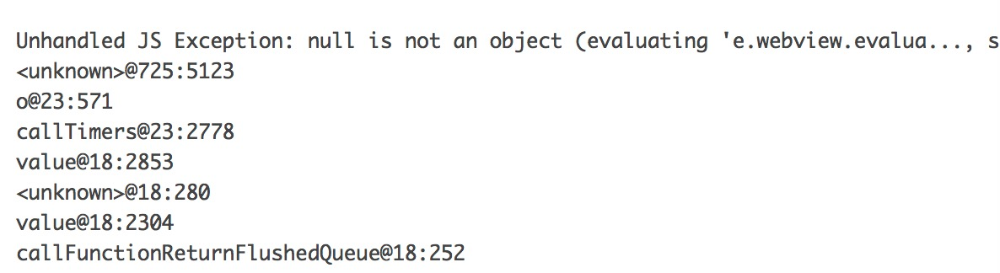

### RN 异常表现

React Native 造成的App体验异常有两种情况

- JS语法错误，界面显示空白，不影响原生其他页面的体验
- JS线程挂掉，引起整个App crash，此时会上报crash日志到统计中心

---

### 解决方案

#### 方案一

接入[`bugsnag`](https://www.bugsnag.com)，可以上报js的详细错误原因

- 需要引入新的库依赖
- 当前为收费，一年费用在
- [接入指引](https://github.com/bugsnag/bugsnag-react-native)

#### 方案二

- JS语法错误，造成界面异常的情况
	- JS`try catch`对风险代码进行保护，处理异常情况，可通过打日志方式定位原因

- JS线程挂掉，分析crash日志
	
	crash日志中可取到错误
	
	最终发布时会打包所有js代码生成`main.jsbundle`文件，日志中`@725:5123`为具体的行号、列号
	
	打包时还会生成另外一个文件`main.jsbundle.map`，用来辅助定位具体出错位置
	
	定位方式：
	
	
```
	var fs = require('fs');
	var sourceMap = require('source-map');

	fs.readFile('../../ios/main.jsbundle.map', 'utf8', function (err, data) {
	var smc = new sourceMap.SourceMapConsumer(data);

	    console.log(smc.originalPositionFor({
			line: 63,
       		column:1502
   		}));
	});
```