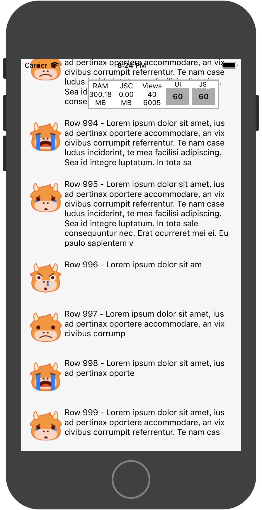
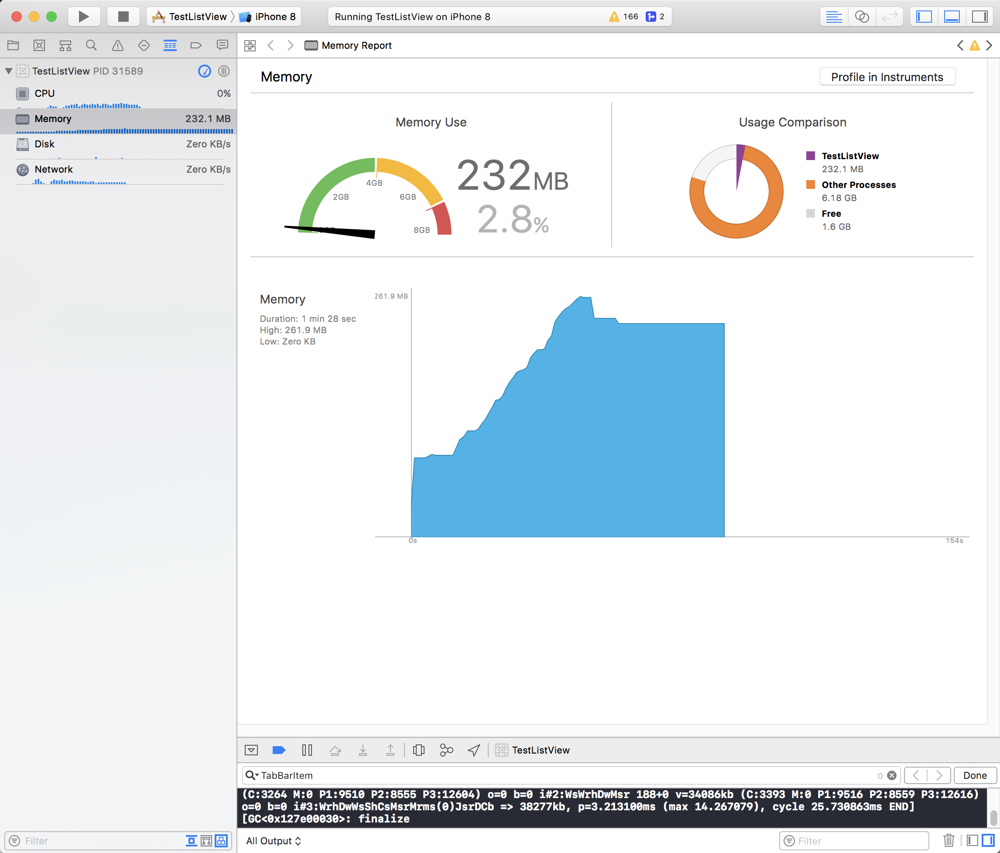
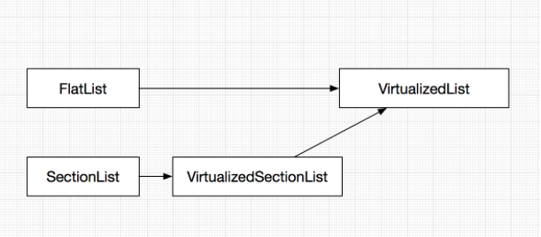
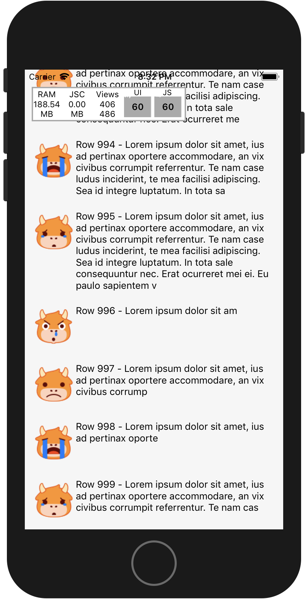
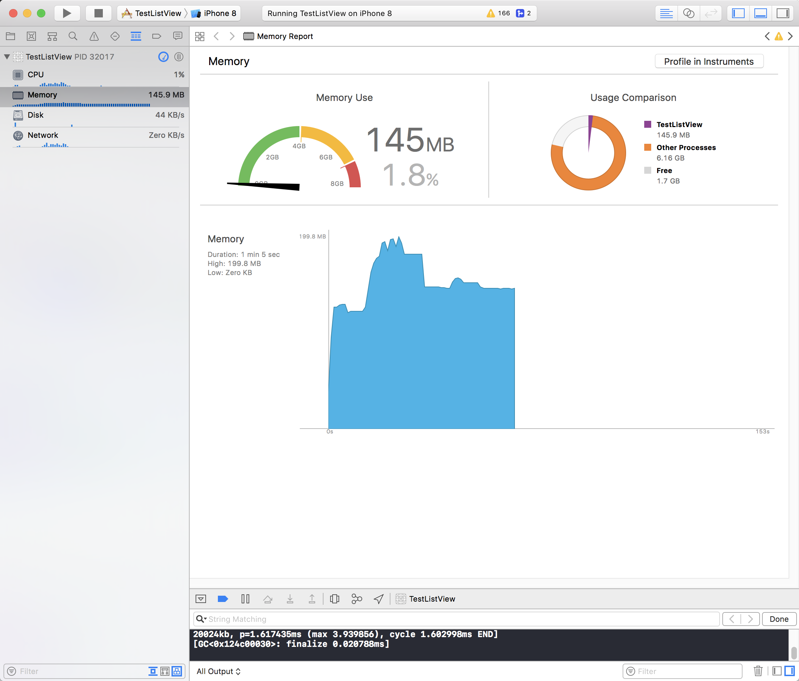

## RN提供的列表组件

### ListView

React Native最早诞生的列表组件，可以方便的用来显示具有纵向滚动属性的数据，实现最基本的两个属性 dataSource 和 renderRow就能让它工作起来。它也支持更多高级的属性，如section和sticky section headers, header，footer，onEndReached等，以及一定的性能优化。为了使ListView滚动更加平滑，在动态的加载一个大的数据（无尽列表）时，可以这样一些优化：

- 只优化发生变化的列：rowHasChanged就是通过比较数据是否发生变化，来判断ListView的row是否需要重绘。
- 限定行渲染的速度：默认每次只渲染一行（可以由pageSize属性来控制），把工作分解为较小的块，以减少渲染时丢帧的几率。

基本用法：

```
<ListView
   dataSource={this.state.dataSource}
   renderRow={(rowData, sectionID, rowID) => this.cell(rowData, rowID)}
/>
```

但是，ListView在处理无尽列表时，表现却不尽人意，它并不会把视图以外的元素从VirtualDom上面移除，在列表长度长度较大时，滚动时往往出现掉帧情况，内存也占用随着列表的滚动，消耗急剧增加。如下图所示：




静置一段时间后，通过XCode分析看出相比峰值内存没有太多的回收

--- 

### FlatList && SectionList

> 可参看源码具体在node_modules/react-native/Libraries/Lists的目录内.
> 
> 例如FlatList的源码: ../node_modules/react-native/Libraries/Lists/FlatList.js




- FlatList和SectionList通过源码可以看出,都是基于VirtualizedList的一种封装实现.
- FlatList实现了单组长列表,而SectionList则实现了分组长列表.
- 同时也具备ScrollView的特性.

#### FlatList

顾名思义，它是一个扁平化的列表，砍掉了section的支持，同时，增加了很多移动端常用的玩法：支持横向滑动，下拉刷新，separator，ScrollToIndex等。相比ListView，性能上也得到了巨大的提升，一般情况下，推荐使用FlatList。

FlatList并没有采用复用机制解决内存问题，而是只渲染屏幕内的Item，超过屏幕的Item会被卸载并回收，以此来提升内存的利用率。[faceboo/react-native官方说明](https://github.com/facebook/react-native/commit/a3457486e39dc752799b1103ebe606224a8e8d32)

```

Better ListView - FlatList
Summary:
We really need a better list view - so here it is!

Main changes from existing `ListView`:

* Items are "virtualized" to limit memory - that is, items outside of the render window are unmounted and their memory is reclaimed. This means that instance state is not preserved when items scroll out of the render window.
* No `DataSource` - just a simple `data` prop of shape `Array<any>`. By default, they are expected to be of the shape `{key: string}` but a custom `rowExtractor` function can be provided for different shapes, e.g. graphql data where you want to map `id` to `key`. Note the underlying `VirtualizedList` is much more flexible.
* Fancy `scrollTo` functionality: `scrollToEnd`, `scrollToIndex`, and `scrollToItem` in addition to the normal `scrollToOffset`.
* Built-in pull to refresh support - set set the `onRefresh` and `refreshing` props.
* Rendering additional rows is usually done with low priority, after any interactions/animations complete, unless we're about to run out of rendered content. This should help apps feel more responsive.
* Component props replace render functions, e.g. `ItemComponent: ReactClass<{item: Item, index: number}>` replaces `renderRow: (...) => React.Element<*>`
* Supports dynamic items automatically by using `onLayout`, or `getItemLayout` can be provided for a perf boost and smoother `scrollToIndex` and scroll bar behavior.
* Visibility callback replaced with more powerful viewability callback and works in vertical and horizontal mode on at least Android and iOS, but probably other platforms as well. Extra power comes from the `viewablePercentThreshold` that lets the client decide when an item should be considered viewable.

```

基本用法：

```
<FlatList
  data={[{key: 'a'}, {key: 'b'}]}
  renderItem={({item}) => <Text>{item.key}</Text>}
/>
```

#### SectionList

如果需要把列表进行分类展示，同时给每个分类设置头部，比如像地址，分类的产品，分类的相册等，SectionList就是最好的选择。

基本用法：

```
<SectionList
  renderItem={({item}) => <ListItem title={item.title} />}
  renderSectionHeader={({section}) => <H1 title={section.key} />}
  sections={[ // homogenous rendering between sections
​    {data: [...], key: ...},
​    {data: [...], key: ...}
  ]}
/>
```

因为`FlatList`与`SectionList`都是基于`VirtualizedList`的封装实现，所以性能相似，所以这里仅给出`FlatList`的性能分析图：

图中可以明显看出同样渲染1000条数据时，使用FlatList静置一段时间后，内存相比峰值会有很明显的回落，内存被回收，并且最终内存占用不足150M，不到`ListView`的一半




--- 

### VirtualizedList

如果你需要更强的定制化的列表，RN的FlatList和SectionList已经不能满足你要的效果，可以在VirtualizedList上增加Wrapper来实现你的定制化。

虚拟化通过维护有限宽度的渲染窗口，并把渲染窗口之外的所有item替换为空，这样大大提高了大型列表的内存消耗和性能，滚动起来也更加的流畅。

## 超长列表的优化

对于列表的优化，主要集中在两个方面，一个是内存消耗，一个用户响应，用户响应又可以分为：滚动是否流畅，对点击等操作响应速度是否迅速。我们先来看看新的列表组件VirtualizedList都给我们带了哪些改进：

> PureComponent: 减少不必要的渲染，如果props属性不变，它就不会重绘。 这里需要我们确保在更新props后不是===，否则UI可能无法更新更新。

> 限定渲染窗口： 通过维护有效项目的有限渲染窗口并把渲染窗口之外的所有元素替换为空（Blank），大大提高了大型列表的内存消耗和性能。

> 低优先级渲染窗口以外的区域：窗口适应滚动行为，如果项目远离可见区域，则项目将以低优先级（在任何运行的交互之后）逐渐呈现，否则为了最小化查看空格的可能性。。

> 异步渲染：内容将异步地渲染在屏幕外。 这意味着可能滚动会比填充率更快，看到空白的内容。


## 小结

FlatList在流畅度的提升还是很明显的，不过，在急速滚动的情况下，中间会出现白屏，这对于用户体验上来说很不友好。这里，我们可以参考VirtualizedList提供的属性来做优化。

- windowSize： 限定绘制的最大数目，默认为21。

- maxToRenderPerBatch：一次绘制的最大数目。

- updateCellsBatchingPeriod：更新绘制的间隔时间。

- initialNumToRender：首次绘制的数目。

- getItemLayout：可以用来帮助我们跳过高度和位置的重新运算，当我们的每一个Item高度一致时，设置这个属性可以极大的提高渲染效率。

```
getItemLayout={(data, index) => (
  {length: ITEM_HEIGHT, offset: (ITEM_HEIGHT+ SEPARATOR_HEIGHT) * index, index}
)}
```


### 其他参考资料

- [React Native 的 ListView 性能问题已解决](https://segmentfault.com/a/1190000008589705)

- [【腾讯 Bugly 干货分享】跨平台 ListView 性能优化](https://juejin.im/entry/584e256a128fe10058b055e1)