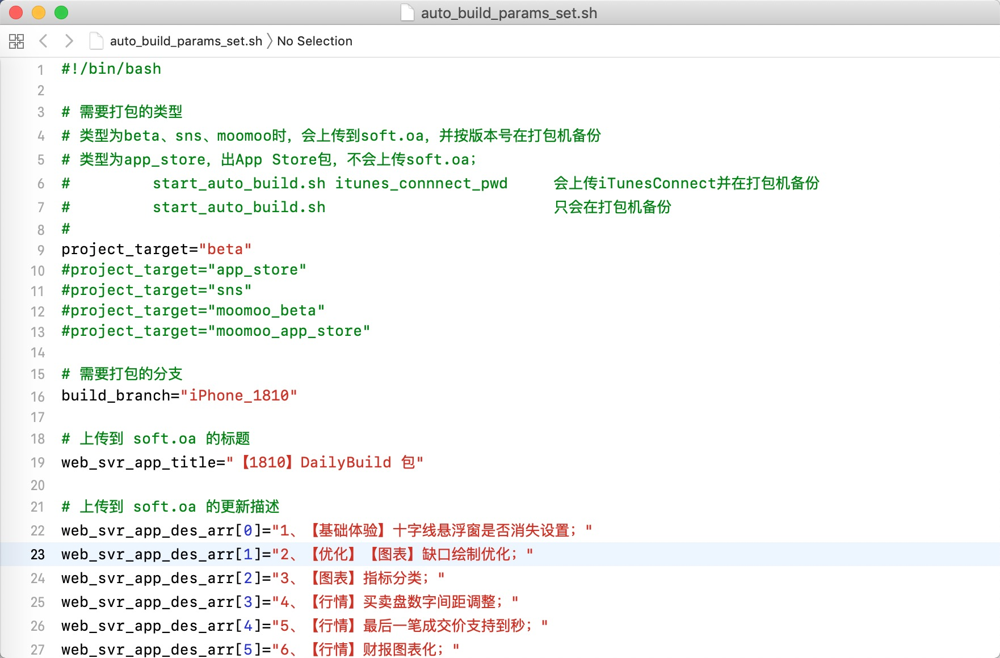
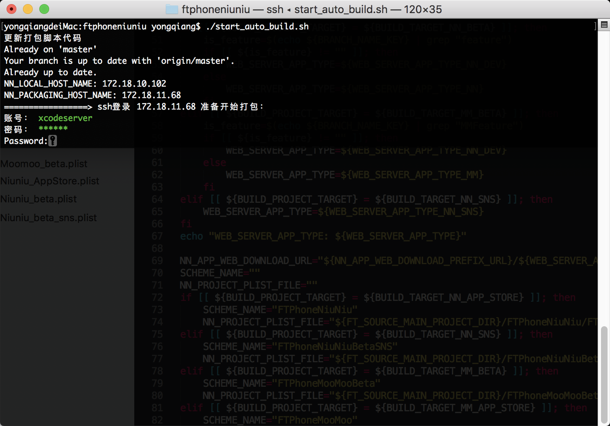
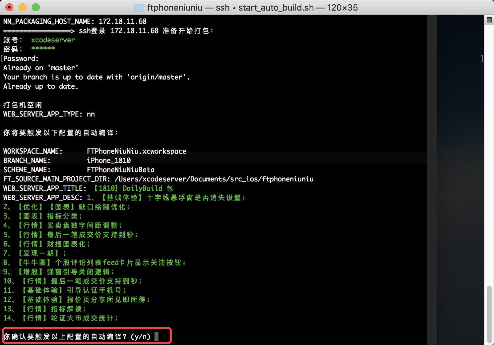
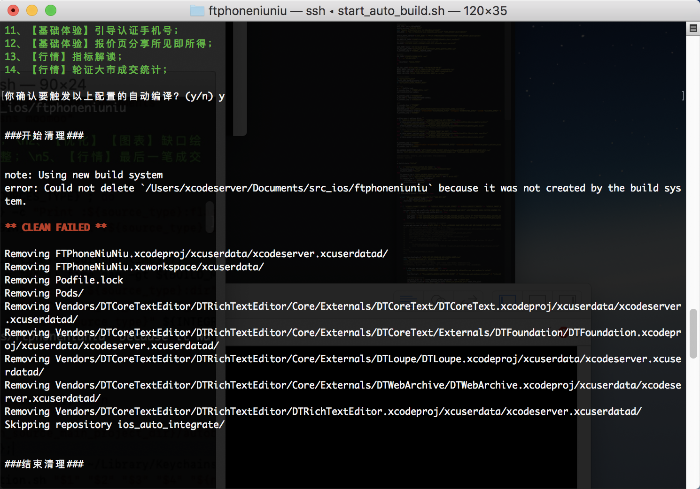
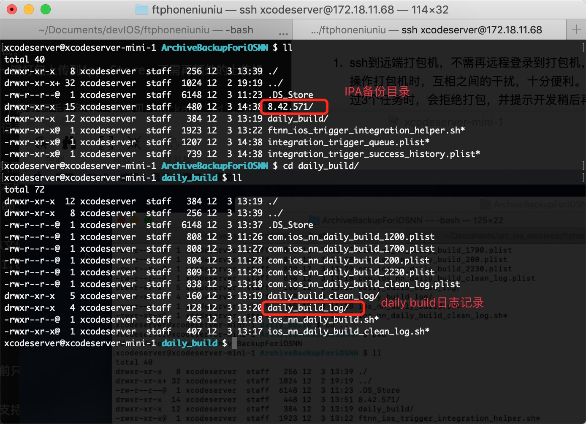

### 一、使用方式

#### 日常使用

1. 打开主工程目录下文件`auto_build_params_set.sh`，按需编辑好打包信息，如下：
	
	
	> 1、`beta`对应上传到soft.oa的测试包；
	>
	> 2、`app_store`出上传到iTunesConnect的提审包
	>
	> 3、`sns`出社交包，并上传到soft.oa
	>
	> 4、`moomoo_beta`出美分包，并上传到soft.oa
	>
	> 5、`moomoo_app_store`出上传到iTunesConnect的美分提审包
	
2. 终端切换到主工程目录下执行脚本`start_auto_build.sh`
	
3. 根据提示输入打包机密码后，检查打包信息是否有误，然后决定是否继续执行打包任务
	
4. 输入`n`会终止打包任务，输入`y`则开始打包任务
	

#### 提交App Store使用（版本负责人关注）

1. 参照文档[iOS牛牛Appstore提审流程](https://futu.lexiangla.com/teams/k100057/docs/f450cb72018c11e889a75254009d059e?company_from=futu)完成步骤1~7。
2. 更改`auto_build_params_set.sh`中`project_target`的值为`app_store`
3. 终端切换到主工程目录下执行脚本`start_auto_build.sh`时，带上iTunesConnect账号的密码作为参数。例如`./start_auto_build.sh password`。
4. 余下步骤参考`日常使用`的步骤3、4。

#### 定时出DailyBuild包（版本负责人关注）

1. 主工程目录下，执行脚本`./switch_daily_build_branch.sh beta iPhone_1810`

	> `beta`为对应target类型，参数只接受`beta`或`sns`；
	>
	> `iPhone_1810`为对应的分支名
	
2. 输入打包机密码即可完成每日编译包的配置
	
---

### 二、新打包脚本提供的功能
1. ssh到远端打包机，不需再远程登录到打包机，解决原有打包脚本多人同时操作打包机时，互相之间的干扰，十分便利。新脚本会自动排队打包，超过3个任务时，会拒绝打包，并提示开发稍后再试。
2. 支持在特定的配置下，可以一键打包上传到App Store，不需再额外的上传操作。
3. 上传新包到`soft.oa`时，不需要再手动新建，再拷贝`package_id`。新脚本在上传新包时，会自动新建并记录下来`package_id`，下次再打包时，编辑`soft.oa`上已有的记录。
4. 缩短打包配置流程，使用者只需关心`auto_build_params_set.sh`中的配置信息，然后执行打包脚本即可。
5. 当前配置为每天2:00、12:00、17:00自动集成，不再需要开发者每天手动去触发。
	
	> 由于每次自动集成的日志文件大于200M，每天会产生700+M的日志记录，过多的占用磁盘，所以会定时每天1:00清理前一天的daily build日志。

---

### 三、待完善的功能

1. 打包日志记录尚未完成，当前只会体现在执行打包人的终端内，没有落地到磁盘。
2. 打包结束后，打包结果尚未支持邮件同步到开发者。

---

### 四、自动集成脚本快速接入

1. 拷贝`ios_auto_integrate/autobuild/client`目录下的`auto_build_params_set.sh`、`start_auto_build.sh`文件到主工程`ftphoneniuniu`下；
2. 按需更改`auto_build_params_set.sh`中的内容；
3. 执行脚本`start_auto_build.sh`便可以开始打包流程；

> 新的脚本上传IPA包到soft.oa时，会自动把包分区。
> 
> beta类型的，如果分支在feature下会归类到`开发自测`下面，其他的会归类到`富途牛牛`
> 
> sns类型的，归类到`富途牛牛社区版`
> 
> moomoo_beta类型的，如果分支在MMFeature下会归类到`开发自测`下面，其他的归类到`富途美分（moomoo）`

---

### 五、错误分析

如果打包失败，先查看调用打包脚本的终端窗口查看失败原因，看下是否是编译失败问题导致。

> 注意事项： 
> 
> 1、大家拉feature分支时，要通过`git_cmd.sh`脚本拉分支，不管其他分支是否会涉及到改动。
> 因为新的打包脚本，打包时会尝试将所有工程的分支切换到`auto_build_params_set.sh`文件配置的分支上去，如果切换分支失败的话，可能会出包失败。
> 
> 2、新的打包脚本依据分支名在soft.oa上建立记录

---

### 六、记录备份

1. `daily build`日志存放在打包机目录`/Users/xcodeserver/ArchiveBackupForiOSNN/daily_build/daily_build_log`，版本负责人按需查看，注意**每天凌晨1:00会定时清理前一天的daily build日志**
2. 打包成功后，IPA包备份在打包机目录`/Users/xcodeserver/ArchiveBackupForiOSNN`，按版本号分类。如下图
	

---

### 六、附录

[iOS 自动集成脚本简介-原理篇](https://futu.lexiangla.com/teams/k100057/docs/c1630a38f63a11e8a274525400b4d70f)