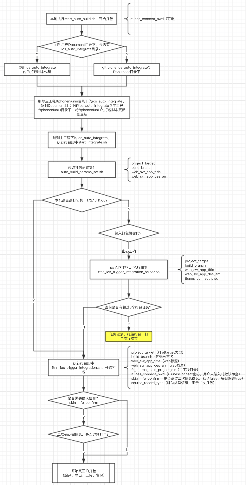
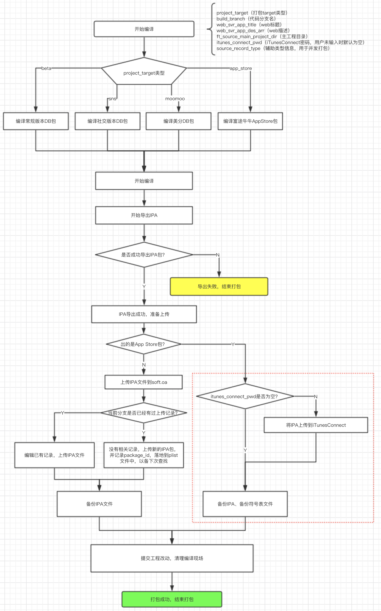

### 一、打包流程使用的变量

#### 用户填入的信息

- `auto_build_params_set.sh`填入

	```
	project_target（打包target类型）
	build_branch（代码分支名）
	web_svr_app_title（web标题）
	web_svr_app_des_arr（web描述）
	```
- 调用脚本传入的参数（选填）

	```
	itunes_connect_pwd（iTunesConnect密码，用户未输入时默认为空）
	```

#### 脚本运行时引入的其他变量（使用者不需关心）

```
ft_source_main_project_dir（主工程目录）
skip_info_confirm（是否跳过二次信息确认，默认false，每日编译true）
source_record_type（辅助类型信息，用于并发打包）
```

---

### 二、自动集成开始



### 编译、导出、上传、备份流程



---

### 三、遇到的问题

1. ssh到远程打包机是，编译成功，导出失败，而直接到打包机上执行打包脚本一切正常

	> security unlock-keychain -p mac@futu5.com ~/Library/Keychains/login.keychain
	
2. 如何读写`plist`文件，用来辅助记录必要信息？

	> `/usr/libexec/PlistBuddy`

3. 为什么不用XcodeServer？

	> 应该是本身有bug，每次都要全量更新代码，巨慢
	
4. 如何实现最多三个打包任务并行？

	> 打包机上clone 三份代码，通过在打包机上建立辅助文件`integration_trigger_queue.plist`，记录当前打包机执行状态
	
5. 如何记住打包记录，以便下次上传时，使用相同的`package_id`

	> 通过在打包机上建立辅助文件`integration_trigger_success_history.plist`，记录历史打包情况
	
6. 如何定时打包？

	> 使用Mac系统自带的工具`launchctl`开启定时任务
	
7. 新的打包脚本有问题时，如何将改好的脚本快速同步到各个分支上？

	> 给打包脚本代码独立建库，各个分支只保留两个十分稳定的执行脚本`auto_build_params_set.sh`、`start_auto_build.sh`，用户使用`auto_build_params_set.sh`来维护打包分支、web标题等信息，`start_auto_build.sh`用来执行打包流程。`start_auto_build.sh`会每次拉取最新的打包脚本代码到用户的根目录下，然后复制最新的打包脚本代码到`ftphoneniuniu`目录下，再执行最新的打包脚本。这样来保证各分支的打包脚本是最新的。脚本有改动时，各分支负责人可以无感知更新打包脚本。
	
8. bash下如何解析web返回的json信息？

	> 使用`JQ`

---

### 四、附录

- [Mac中的定时任务利器：launchctl](https://blog.csdn.net/clwwlc/article/details/79849686)
- [iOS远程自动打包问题](https://www.jianshu.com/p/b03e59560d31)
- [jq : Linux下json的命令行工具](http://blog.chinaunix.net/uid-24774106-id-3830242.html)
- [iOS 自动集成脚本简介-使用篇](https://futu.lexiangla.com/teams/k100057/docs/d6982014f63a11e88664525400177fdc?company_from=futu)