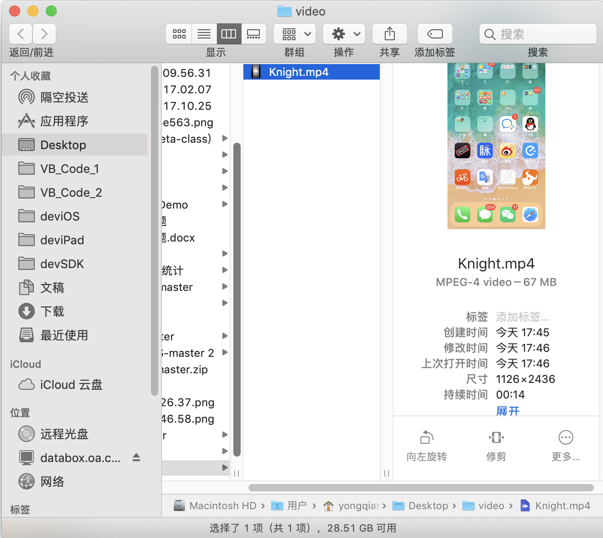

## 一、常见的启动时间测试方法介绍及对比

常见的 iOS 启动时长测试方法，主要有以下几种

- Xcode Developer Tool： 使用 Instruments 的 Time Profiler 插件，可以检测 App CPU 的使用情况。能看到 App 的启动时间和各个方法消耗的时间；
- 客户端计算统计： 通过 hook 关键函数的调用，计算获得性能数据。目前知乎 App 性能监控已有启动时长数据，类似的还有一些第三方的性能测试工具；
- 录屏：使用截屏、录屏、高速摄像机录像等方法，记录移动设备屏幕上的变化，分析启动的起止点，获取 app 启动的耗时。

> 方法 1 可以精确获取各个方法调用的耗时，需要 App 是 developer 证书签名，否则无法执行测试；
>
> 方法 2 可以精确获取各个启动项耗时，但和实际用户体验感受有一定出入，且需要拿到客户端源码，将工具嵌入客户端中；
>
> 方法 3 和用户直观感受一致，但分析截屏、视频较麻烦，且发现问题时，无法定位到具体的启动耗时项。目前对于竞品启动时长的对比测试，由于源码和签名的限制，方法 1 和 2 都不太合适。


## 二、录屏分析法

### 1. 屏幕录制

#### 1.1 [xrecord](https://github.com/WPO-Foundation/xrecord)

xrecord安装

  `git clone https://github.com/WPO-Foundation/xrecord`，找到`bin/xrecord`

查看Mac上可录制设备

  `xrecord --quicktime --list --debug`

  ```shell
  yongqiangdeiMac:~ yongqiang$ xrecord --quicktime --list --debug
  Available capture devices:
  AppleHDAEngineInput:1F,3,0,1,0:1: Built-in Microphone
  71d50601a2464b5b55cb62ec62a181b19cc2b235: Knight
  0x1440000005ac8511: FaceTime HD Camera (Built-in)		
  ```

	> 问题：如果让iPhone显示在以上list列表中呢？
	> 打开Mac的quicktime，新建影片录制，并选择录像设备是iPhone。然后输入命令即可

- 从iPhone上录屏

  `xrecord --quicktime --name "Knight" --out="/Users/yongqiang/Desktop/video/Knight.mp4" --force`

  

#### 1.2 QuickTime

新建影片录制，设备选择iPhone


### 2. ffmpeg将视频分帧

#### 2.1 MAC安装FFMPEG

通过 FFmpeg 将视频转换成分帧后的图像，剔除相似度较高的图像后，再进行人工选取关键节点。

`ffmpeg -i Knight.mp4 -y -f image2 -s 1126*2436 /Users/yongqiang/Desktop/video/IMAGES/%05d.jpg`


## 三、参考资料

- [安装xrecord](https://github.com/WPO-Foundation/xrecord)
- [MAC安装FFMPEG](https://yujianbin.github.io/2019/01/24/macffmpeg/)
- [ios-deploy](https://github.com/ios-control/ios-deploy)
- [知乎 iOS App 启动时间测试实践](https://zhuanlan.zhihu.com/p/48218035)