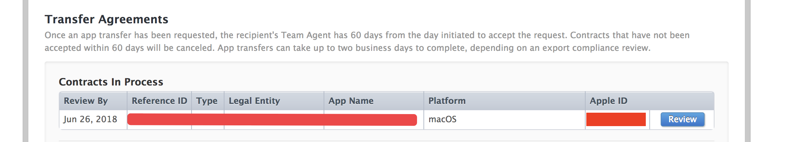

由于业务需要，需要将开发的App从一个账号(A账号)转移到另一个账号（B账号），这里简单介绍一下转让流程。主要包括两大步骤：

1. 转让方（A账号）提出转让申请
2. 接收方（B账号）接受转让App

如果不想看这篇流程，可以直接查看官方给出的一些资料，详情可参见[这里](http://itunespartner.apple.com/cn/apps/faq/App%20%E8%BD%AC%E8%AE%A9_App%20%E8%BD%AC%E8%AE%A9%E6%B5%81%E7%A8%8B)。

如果不想看上面的东西，那就继续往下浏览。

苹果在iTC后台已为我们提供了一个通道，无需下架删除app，即可将其所有权转让给其他开发者账号。且在转让期间和转让后，app评论和评分均可保留。转让后，用户还可以继续进行更新。

当然，转让app也是有条件的：

1. 此app拥有至少一个已获批的版本；
2. 此app处于“已经上架”、“准备提交”、 “被开发者拒绝”或“被开发者下架”等状态；
3. 任意关联的app内购买项目处于“准备提交”、“已经上架”、“被开发者下架”或“已批准”等状态。

--- 

## 1. 转让方（A账号）提出转让申请

如果你的app符合这些条件，在iTC后台【我的App】部分，点击该app的图标之 后，“App信息”的最下方就会有【转让App】这个按钮。

点击【转让App】，会出现一些提示信息，如果满足了上面的条件（全是绿色 √  就是符合条件），且没有其他疑问的话，就可以点击【继续】按钮了。

接着，便会跳转到【接收者信息】页面，按照要求填写接收者的团队代理Apple ID和团队ID即可

注：如果不清楚什么是接收者的团队代理Apple ID和团队ID，可以点击右侧带有  的按钮，里面有名词解释&查询方法。

填好之后，点击【继续】，会跳转到【App转让信息和合同条款】页面。填写转让者、接收者等信息、阅读合同条款并勾选左侧的【本人已阅读并同意上文显示的条款】后，点击【请求转移】即可。

转让请求成功后，可以在【App信息】最上方看到已提交的信息提示，如下图所示：

---

## 2.接收方（B账号）接受转让APP

之后，便可以通知接收方登录iTunes Connect来接收这个app了。接收方只需进入他的账户，按照提示（登录接收方账号后，会出现“协议更新”的提示，点击【继续】，然后在跳出的页面的提示框，点击“协议、税务和银行业务”部分接收app）操作即可！

一般情况下，完成app转让最多需要2个工作日。如果对方在60天之内没有接受，那系统会自动取消。

然后点击“协议、税务和银行业务”，进入之后，然后按照下图的箭头点击：

然后会让你填写一些信息，具体内容如下：

这里按照要求填写响应内容即可。 这里我遇到的一个小问题就是手机号码加上了“+86”依然报错，最后多尝试了几次（在86后面+空格，将空格删掉等），才消除错误。

然后点选同意显示的条款，最后点击”Accept”按钮就ok了。这时你会发现此App已经成功转让到B账号了。

注：App Store里面显示的开发者更新会有延迟