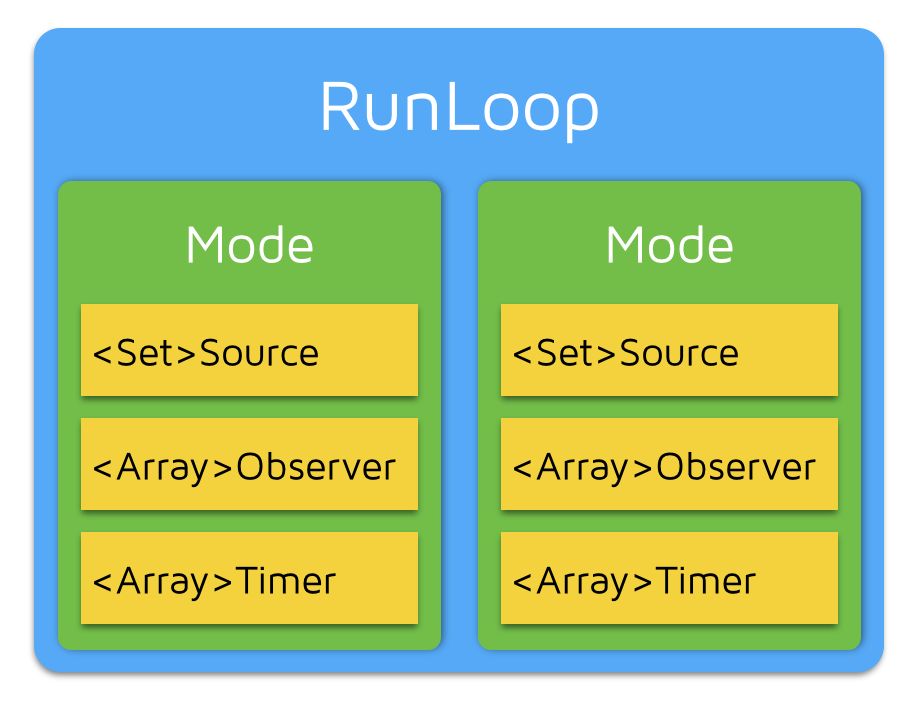
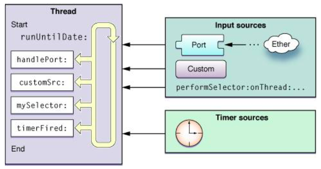

##RunLoop是什么?

Run -> 跑，Loop -> 圈，RunLoop -> 跑圈. 对的，简单地说，RunLoop就是一种比较高大上的do-while循环.

```
void runloop() {
  init(); 
  do {
      id msg = getMessage();
      handleMessage(msg);
  } while (msg != quit);
}
```

RunLoop也是对象，Foundation/Core Foundation中分别为NSRunLoop与CFRunLoopRef. 一般来说，一个线程与一个RunLoop对象一一绑定，主线程在程序的入口UIApplicationMain函数中就会自动创建一个Main RunLoop，以便主线程就算处理完了所有事件，任务也不会退出，否则我们的程序一run，就return没了，就像一些命令行项目那样.

在我们手动开启一条子线程时，系统并不会默认帮我们创建对应的RunLoop，而是需要我们调用[NSRunLoop currentRunLoop]才会创建(如果已经存在RunLoop，则直接返回; 否则，创建RunLoop并返回).

##RunLoop里有什么



每个RunLoop中有若干个mode，每个mode可以有若干个source，timer，observer.

**mode : CFRunLoopModeRef**

RunLoop在同一时间只能且必须在一种mode下Run，要更换mode时，只能停止当前loop，重启开启新的loop

* NSDefaultRunLoopMode : 默认状态，空闲状态
* UITrackingRunLoopMode : 滑动scrollView时
* UIInitializationRunLoopMode : 私有Mode，APP启动时用,之后无用
* NSRunLoopCommonModes : 默认情况下包含Default和Tracking模式，可自行添加mode，相当于mode的集合

举个栗子 : NSTimer默认是在NSDefaultRunLoopMode中工作的，当你啥也不干的时候，它能正常运作，但是当你开始拖拽UIScrollView的时候，它就不干了. 原因是当你拖拽的时候，MainRunLoop切换到了UITrackingRunLoopMode，所以timer便暂时失效了，当你松手的时候，timer又继续工作了. 解决办法就是把这个timer加入到两个mode中，也可以直接添加到NSRunLoopCommonModes中.

**source : CFRunLoopSourceRef**

其实是RunLoop的数据源抽象类，相当于任何遵循这个protocol的对象都能当RunLoop的数据源

* source0 : 处理App内部事件，App自己负责管理(触发)，如UIEvent，CFSocket
* source1 : 由RunLoop和内核管理，Mach port驱动，如CFMachPort，CFMessagePort
简单的说就是source0不基于mach port，source1基于mach port

**timer : CFRunLoopTimerRef**

NSTimer其实就是CFRunLoopTimerRef，它们两个是toll-free bridged. 需要注意的是加入到timer上处理的事件并不是马上处理的，如果你设置的delay属性是5秒，事实上是经过5秒钟之后才把该事件送到RunLoop中，等到下一次RunLoop的时候才处理.

**observer : CFRunLoopObserverRef**

根据RunLoop状态的改变通知observer，observer会向外部报告RunLoop的状态的更改，框架中很多机制都由RunLoopObserver触发，如CAAnimation

```
typedef CF_OPTIONS(CFOptionFlags，CFRunLoopActivity) {
    kCFRunLoopEntry         = (1UL
```

##autoreleasepool

虽然RunLoop并不自带autoreleasepool，但是如每个程序的main函数所示,

```
int main(int argc，char * argv[]) {
    @autoreleasepool {
        return UIApplicationMain(argc，argv，nil，NSStringFromClass([AppDelegate class]));
    }
}
```

每个RunLoop都应该被至少一个autoreleasepool包围着，这样才能保证在Loop中产生的autorelease对象能够正常释放而不至于造成内存泄漏. 所以RunLoop在处理任何任务以前必定是先push一个autoreleasepool，在休眠之前要先pop再push一个autoreleasepool，退出则是直接pop掉就可以了.

另外，有一种情况是我们必须手动显式创建autoreleasepool的，那就是当一个循环里，例如for循环，大量创建autorelease对象时，我们应该在for循环中用一个autoreleasepool把代码都包住，这样能防止内存达到峰值，影响app的稳定运行. 苹果也在很多方法里也采用了这种方法，例如字典的遍历方法，内部就有一个autoreleasepool.

##RunLoop是怎么工作的



上图的是苹果文档给的图，sources分为两种，一种是input sources，另一种为timer sources.

* input sources : 传递异步事件，通常消息来自于其他线程或程序.
* timer sources : 传递同步事件，发生在特定时间或者重复的时间间隔.

当sources到来的时候，唤醒RunLoop，该干嘛干嘛. 具体流程可如下所示 :


对应的伪代码如下 :

```
SetupThisRunLoopRunTimeoutTimer(); // by GCD timer，此次Loop的过期时间
do {
    // 告诉observer我要跑timers和sources啦
    __CFRunLoopDoObserver(kCFRunLoopBeforeTimers);
    __CFRunLoopDoObserver(kCFRunLoopBeforeSources);

    __CFRunLoopDoBlocks(); // 处理timer事件
    __CFRunLoopDoSource0(); // 遍历source0，去处理

    CheckIfExistMessagesInMainDispatchQueue(); // 问GCD是否有分到主线程的任务需要我帮你去调

    __CFRunLoopDoObservers(kCFRunLoopBeforeWaiting); // 告诉observer我要睡了(挂起)
    // **注意 : 这里会pop掉autoreleasepool，并push一个新的autoreleasepool**

    var wakeUpPort = SleepAndWaitForWakingUpPorts(); // 进入trap状态，代码卡在这里，不会再往下执行，直到被别人唤醒
    // mach_msg_trap
    // Zzz...

    // Received mach_msg，wake up
    __CFRunLoopDoObservers(kCFRunLoopAfterWaiting); // 告诉observer我被唤醒
    // Handle msgs
    if (wakeUpPort == timerPort) { // 假如是timer唤醒我的，那就处理timer
    __CFRunLoopDoTimers();
    } else if (wakeUpPort == mainDispatchQueuePort) { // 假如是主线程的GCD把我唤醒的，那就处理GCD的事件
    __CFRUNLOOP_IS_SERVICING_THE_MAIN_DISPATCH_QUEUE__();
    } else { // 基于port事件，比如网络某端口数据到了，就会去处理数据
    __CFRunLoopDoSource1(); 
    } // RunLoop一圈跑完
} while(!stop && !timeout);
```

##RunLoop有什么用

**1. 开启后台常驻线程处理用户事件，如AFNetworking**

```
+ (void)networkRequestThreadEntryPoint:(id) __unused object {
    @autoreleasepool {
        [[NSThread currentThread] setName:@"AFNetworking"];

        NSRunLoop \*runloop = [NSRunLoop currentRunLoop];
        [runloop addPort:[NSMachPort port] forMode:NSDefaultRunLoopMode];
        [runloop run];
    }

}

+ (NSThread \*)networkRequestThread {
    static NSThread \*_networkRequestThread = nil;
    static dispatch_once_t onceToken;
    dispatch_once(&onceToken，^{
        _networkRequestThread =
        [[NSThread alloc] initWithTarget:self
                            selector:@selector(networkRequestThreadEntryPoint:)
                              object:nil];
        [_networkRequestThread start];
    });
    return _networkRequestThread;
}
```


AFN为了其在后台线程中能接受到delegate回调，特意单独创建一个线程，并在该线程启动一个RunLoop. 需要注意的是，RunLoop在开启之前必须要有至少一个source/observer/timer，所以他添加了一个[NSMachPort port]，该port没有传递任何需要处理的事件，只是为了保持RunLoop不至于退出，仅此而已.

**2. 决定程序何时处理Event(哪个模式下，什么时候)**

这里就应用到tableView上，注册一个observer，在Main RunLoop即将进入休眠，没活干的时候，杀出. 在这里做一些cell的高度计算及缓存，数据处理操作. 还有在tableView滑动的时候在cell里设置当RunLoopMode为UITracking模式的时候不要设置图片，为DefaultMode的时候才设置图片，优化tableView的滑动卡顿问题.

##AsyncDisplayKit

AsyncDisplayKit是 Facebook 推出的用于保持界面流畅性的框架.

UI线程(主线程)中一旦出现繁重的操作，就会造成卡顿. 如排版，绘制，UI对象操作.

排版通常包括计算视图大小、计算文本高度、重新计算子式图的排版等操作。
绘制一般有文本绘制 (例如 CoreText)、图片绘制 (例如预先解压)、元素绘制 (Quartz)等操作。
UI对象操作通常包括 UIView/CALayer 等 UI 对象的创建、设置属性和销毁。
ASDK做的就是把所有可以能放到后台线程操作的事情全部放到后台线程中操作，不能的就尽可能的推迟其进行. ASDK是通过注册一个主线程的observer，监听其即将进入休眠和即将退出循环的两个状态，在此把之前推迟的任务全部放到待处理队列中一一执行.