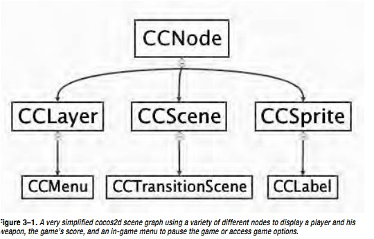
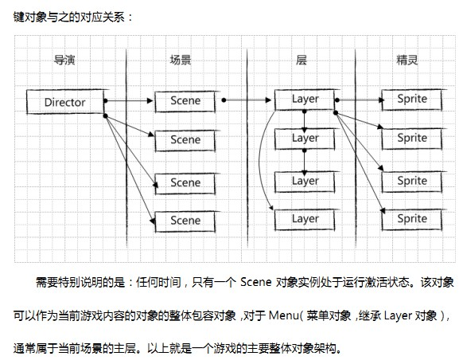

*  切换全屏场景的时候最好使用replaceScene而不是pushScene。

因为pushScene并不会销毁前一个scene，仅仅是将后一个scene按照堆栈的方式加入到前一个scene的上面。如果自身代码中内存管理写的不好的，利用pushScene很难发现该方面的问题，一旦崩溃定位都很难定位。replaceScene可以及早的将隐含的问题给暴露出来。

* 尽量不要在onEnter里面初始化精灵Sprite

这个就和上一条有点关系了，如果使用了pushScene，那么再popScene的时候是不会调用前一个场景的init方法的，所以有同学就喜欢把一些初始化放在onEnter里面，具体为什么不好，我们来看一下不同切换场景的时候，每个Scene的生命周期就知道了。
假设scene A是活动场景，现在我们用scene B来pushScene替换A，A和B的生命周期是这样的：

```
B ---- init();
A ---- onExit();
B ---- onEnter();
B ---- onEnterTransitionDidFinish();
```

此时popScene，弹出scene B，函数调用如下：

```
B ---- onExit();
B ---- 析构函数被调用
A ---- onEnter();
```

从上面可以看出以下几点，

1. A的析构函数始终未被调用，因此A一直在内存中。
2. 先执行B的init()函数，之后才调用A的onExit()方法，再之后才调用B的onEnter();所以初始化最好应该放在init中来初始化。在上一个场景退出之前初始化好后一个场景需要的资源。

同样的，我们再来看一下replaceScene切换场景，scene的生命周期

假设scene A是活动场景，现在我们用scene B来replaceScene替换A，A和B的生命周期是这样的：

```
B ---- init();
A ---- onExit();
A ---- 析构函数被调用
B ---- onEnter();
B ---- onEnterTransitionDidFinish();
```

此时B replace A回来的调用跟上面一样，如下：

```
A ---- init();
B ---- onExit();
B ---- 析构函数调用
A ---- onEnter();
```

* 一些基本的



CCDirector: 导演，负责场景的切换以及场景的信息。如宽度，高度，旋转场景内容。

CCScene: 场景. 场景包含有布景，精灵，每场戏的不同，要切换场景。游戏中可分为主界面， 游戏， 分数榜，结束界面等。

CCLayer: 布景. 类似是层的概念，也可来源于PS的层的概念。每一层都带有众多精灵等

CCSprite: 精灵。就是演员的，演员就需要加入到层里面去的。有相应的动作。

CCAction: 动作。精灵的动作。

scene(即 CCScene类)是app 工作流上独立块。scene也叫做 screents 或者“stages”. 一个app可能拥有多个scenes, 但在任何时候只能有一个是激活状态的。



一个cocos2d CCScene 对象 由一个或多个layers组成（layer即CCLayer 对象），layers之间是前后相连的。layer提供了scene的外观 appearance和行为behavior；通常的用法是直接用一个或多个layers实例化一个scence; CCScene的子类CCTrasitionScene 实现移动transitions , 提供两个scenes 之间的转移效果（(比如fade out/in, slide from a side, 等效果).）由于scenes 是CCNode子类，所以scenes可以手工或者用actions来转变坐标