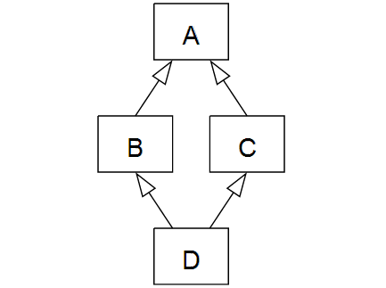
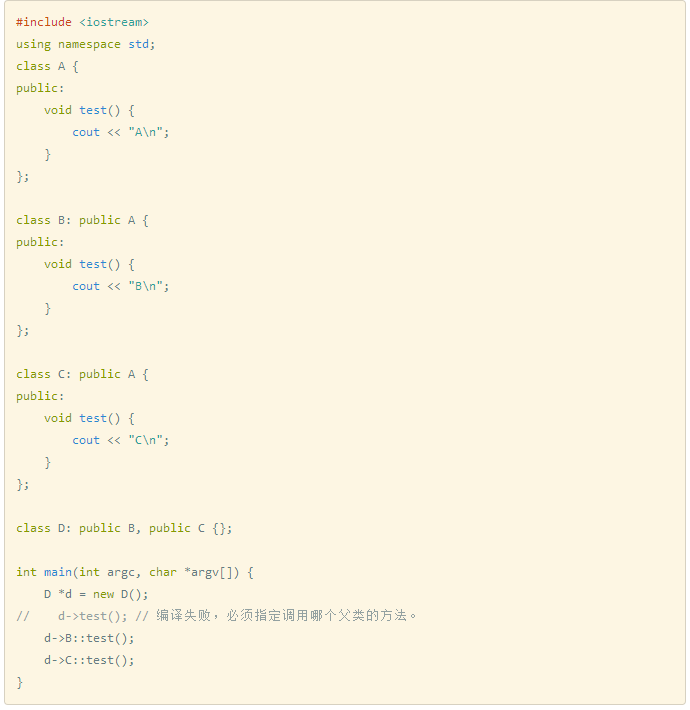
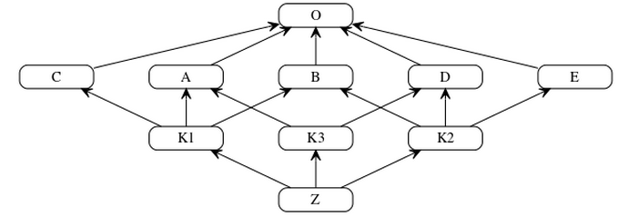
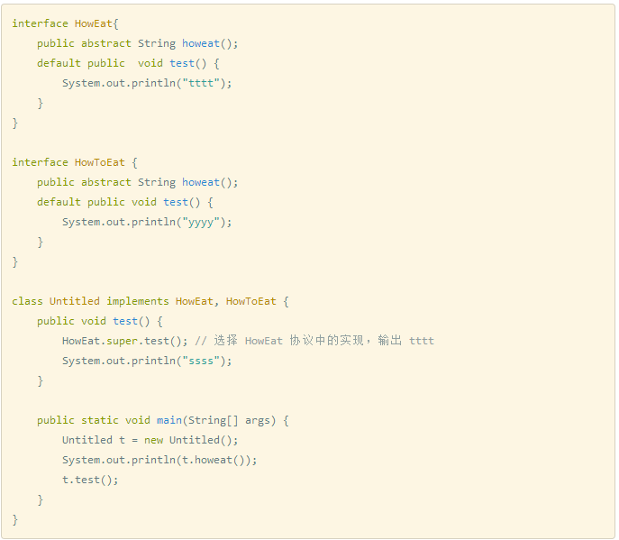
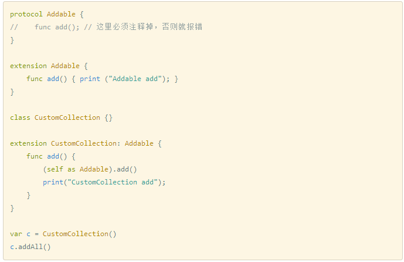
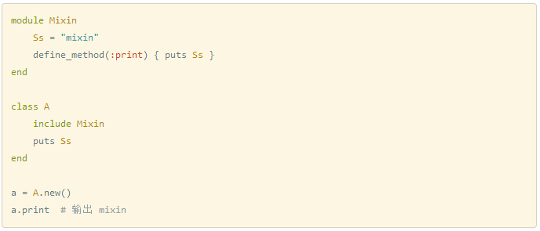
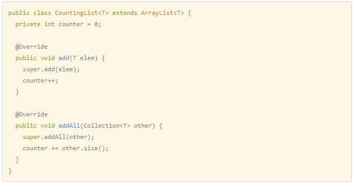

**写在最前**

文章标题谈到了面向协议编程(下文简称 POP)，是因为前几天阅读了一篇讲 Swift 中 POP 的文章。本文会以此为出发点，聊聊相关的概念，比如接口、mixin、组合模式、多继承等，同时也会借助各种语言中的例子来阐述我的思想。

那些老生常谈的概念，相信每位读者都耳熟能详了，我当然不会无聊到浪费时间赘述一遍。我会试图从更高一层的角度对他们做一个总结，不过由于经验和水平有限，也难免有所疏漏，欢迎交流讨论。

最后啰嗦一句:没有银弹

---
**Swift 的 POP**

Swift 非常强调 POP 的概念，如果你是一名使用 Objective-C (或者 Java 等某些语言)的老程序员，你可能会觉得这是一种“新”的编程概念。甚至有些文章喊出了:“放弃面向对象，改为面向协议”的口号。这种说法从根本上讲就是完全错误的。

* 面向接口

首先，面向协议的思想已经提出很多年了，很多经典书籍中都提出过:“面向接口编程，而不是面向实现编程”的概念。

这句话很好理解，假设我们有一个类——灯泡，还有一个方法，参数类型是灯泡，方法中可以调用灯泡的“打开”和“关闭”方法。用面向接口的思想来写，就会把参数类型定义为某个接口，比如叫 Openable，并且在这个接口中定义了打开和关闭方法。

这样做的好处在于，假设你将来又多了一个类，比如说是电视机，只要它实现了 Openable 接口，就可以作为上述方法的参数使用。这就满足了:“对拓展开放，对修改关闭”的思想。

很自然的想法是，为什么我不能定义一个灯泡和电视机的父类，而是偏偏选择接口？答案很简单，因为灯泡和电视机很可能已经有父类了，即使没有，也不能如此草率的为它们定义父类。

* 接口的缺点

所以在这个阶段，你暂且可以把接口理解为一种分类，它可以把多个毫无关系的类划分到同一个种类中。但是接口也有一个重大缺陷，因为它只是一种约束，而非一种实现。也就是说，实现了某个接口的类，需要自己实现接口中的方法。

有时候你会发现，其实像继承那样，拥有默认实现也是一件挺好的事。还是以灯泡举例，假设所有电器每一次开、关都要发出声音，那么我们希望 Openable 接口能提供一个默认的 open 和 close 的方法实现，其中可以调用发出声音的函数。再比如我的电器需要统计开关次数，那我就希望 Openable 协议定义了一个 count 变量，并且在每次开关时对它做统计。

显然使用接口并不能完成上述需求，因为接口对代码复用的支持非常差，因此除了某些非常大型的项目(比如 JDBC)，在客户端开发中(比如 Objective-C)使用面向接口的场景并不非常多见。

* Swift 的改进

Swift 之所以如此强调 POP，首先是因为面向协议编程确实有它的优点。想象如下的继承关系:

B、C 继承自 A，B1、B2继承自 B，C1、C2继承自 C

如果你发现 B1 和 C2 具有某些共同特性，完全使用继承的做法是找到 B1 和 C2 的最近祖先，也就是  A，然后在 A 中添加一段代码。于是你还得重写 B2 和 C1，禁用这个方法。这样做的结果是 A 的代码越来越庞大臃肿， 变成了一个上帝类(God Class)，后续的维护非常困难。

如果使用接口，则又回到了上述问题，你得把方法实现在 B1 和 C2 中写两次。之所以在 Swift 中强调 POP，正是因为 Swift 为协议提供了拓展功能，它能够为协议中规定的方法提供默认实现。现在让 B1 和 C2 实现这个协议，既不影响类的继承结构，也不需要写重复代码。

似乎 Swift 的 POP 毫无问题？答案显然是否定的。

* 多继承

如果站在更高的角度来看 Protocol Extension，它并不神奇，仅仅是多继承的一种实现方式而已。理论上的多继承是有问题的，最常见的就是 Diamond Problem。它描述的是这种情况:

B、C 继承自 A，D 继承自 B 和 C

如下图所示(图片摘自维基百科):

Diamond Problem

如果类 A、B、C 都定义了方法 test，那么 D 的实例对象调用 test 方法会是什么结果呢？

可以认为几乎所有主流语言都支持多继承的思想，但并不都像 C++ 那样支持显式的定义多继承。尽管如此，他们都提供了各种解决方案来规避 Diamond Problem，而 Diamond Problem 的核心其实是不同父类中方法名、变量名的冲突问题。

我选择了五种常见语言，总结出了四种具有代表性的解决思路:

显式支持多继承，代表语言 Python、C++

利用 Interface，代表语言 Java

利用 Trait，代表语言 Swift、Java8

利用 Mixin，代表语言 Ruby

---
**显式支持多继承**

最简单方式就是直接支持多继承，具有代表性的是 C++ 和 Python。

* C++

在 C++ 中，你可以规定一个类继承自多个父类，实际上这个类会持有多个父类的实例(虚继承除外)。当发生函数名冲突时，程序员需要手动指定调用哪个父类的方法，否则就无法编译通过:

可见，C++ 给予程序员手动管理的权利，代价就是实现比较复杂。

* Python

Python 解决函数名冲突问题的思路是: 把复杂的继承树简化为继承链。为此，它采用了 C3 Linearization 算法，这种算法的结果与继承顺序有密切关系，以下图为例:

* 继承树

假设继承的顺序如下:

class K1 extends A, B, C

class K2 extends D, B, E

class K3 extends D, A

class Z extends K1, K2, K3

求 Z 的继承链其实就是将 [[K1、A、B、C]、[K2、D、B、E]、[K3、D、A]] 这个序列扁平化的过程。

我们首先遍历第一个元素 K1，如果它只出现在每个数组的首位，就可以被提取出来。在这里，显然 K1 只出现在第一个数组的首位，所以可以提取。同理，K2、K2 都可以提取。于是上述问题变成了:

[K1、K2、K3、[A、B、C]、[D、B、E]、[D、A]]

接下来会遍历到 A，因为它在第三个数组的末尾出现过，所以不能提取。同理 B 和 C 也不满足要求。最后发现 D 满足要求，可以提取。以此类推……完整的文档可以参考 WikiPedia。

最终的继承链是: [K1, K2, K3, D, A, B, C, E]，这样多继承就被转化为了单继承，自然也就不存在方法名冲突问题。

可见，Python 没有给程序员选择的权利，它自动计算了继承关系，我们也可以利用 `__mro__` 来查看继承关系:

---
* Interface

Java 的 Interface 采用了一种截然不同的思路，虽然它也是一种多继承，但仅仅是“规格继承”，也就是说只继承自己能做什么，但不继承怎么做。这种方法的缺点已经提过了，这里仅仅解释一下它是如何处理冲突问题的。

在 Java 中，即使一个类实现了多个协议，且这些协议中规定了同名方法，这个类也仅能实现一次，于是多个协议共享同一套实现，笔者认为这不是一种好的解决思路。

在 Java 8 中，协议中的方法可以添加默认实现。当多个协议中有方法冲突时，子类必须重写方法(否则就报错)， 并且按需调用某个协议中的默认实现(这一点很像 C++):

---
* Trait

尽管提供协议方法的默认实现在不同语言中有不同的称谓，一般我们将其称为 Trait，可以简单理解为 Trait = Interface + Implementation。

Trait 是一种相对优雅的多继承解决方案，它既提供了多继承的概念，也不改变原有继承结构，一个类还是只能拥有一个父类。在不同语言中，Trait 的实现细节也不尽相同，比如 Swift 中，我们在重写方法时，只能调用没有定义在 Protocol 中的方法，否则就会产生段错误:

查阅相关资料后发现，这和 Swift 方法的静态派发与动态派发有关。

---
* Mixin

另一种与 Trait 类似的解决方案叫做 Mixin，它被 Ruby 所采用，可以理解为 mixin = trait + local_variable。在 Ruby 中，多继承的层次结构更加扁平，可以这么理解:“一旦某个模块被 mixin 进来，它的宿主模块立刻就拥有了 mixin 模块的所有属性和方法”，就像 OC 中的 runtime 一样，这更像是一种元编程的思想:

---
**总结**

相比于完全允许多继承(C++/Python)和几乎完全不允许多继承(Java)而言，使用 Trait 或者 Mixin 显得更加优雅。虽然它们有时候并不能很方便的指定调用某一个“父类”中的方法， 但这种利用单继承来模拟多继承的的思想有它独特的有点: “不改变继承树”，稍后会做分析。

---

**继承与组合**

文章的开头我曾经说过，Swift 的 POP 并不是一件多么了不起的事，除了面向接口的思想早就被提出以外， 它的本质还是继承，也就无法摆脱继承关系的天然缺陷。至于说 POP 取代 OOP，那就更是无稽之谈了，多继承也是 OOP，一种略优雅的实现方式如何称得上是取代呢？

* 继承的缺点

有人说继承的本质不是自下而上的抽象，而是自上而下的细化，我自认没有领悟到这一层，不过使用继承的主要目的之一就是实现代码复用。在 OOP 中，使用继承关系，我们享受了封装、多态的优点，但不正确的使用继承往往会自食其果。

* 封装

一旦你继承了父类，就会立刻拥有父类所有的方法和属性，如果这些方法和属性并非你本来就希望对外暴露的，那么使用继承就会破坏原有良好的封装性。比如，你在定义 Stack 时可能会继承自数组:

虽然你成功的在数组的基础上添加了 push 和 pop 方法，但这样一来就把数组的其他方法也暴露给外界了，而这些方法并非是 Stack 所需要的。

换个思路考虑问题，什么时候才能暴露父类的接口呢，答案是:“当你是父类的一种细化时”，这也就是我们强调的 is-a 的概念。只有当你确实是父类，能在任何父类出现的地方替换父类(里氏替换原则)时，才应该使用继承。在这里的例子中，栈显然并不是数组的细化，因为数组是随机访问(random-access)，而栈是线性访问。

这种情况下，正确的做法是使用组合，即定义一个类 Stack，并持有数组对象用来存取自身的数据，同时仅对外暴露必要的  push 和 pop 方法。

另一种可能的破坏封装的行为是让业务相关的类继承自工具类。比如有一个类的内部需要持有多个 Customer 对象，我们应该选择组合模式，持有一个数组而不是直接继承自数组。理由也很类似，业务模块应该对外屏蔽实现细节。

这个概念同样适用于 Stack 的例子，相比于数组实现而言，栈是一种具备了特殊规则的业务实现，它不应该对外暴露数组的实现接口。

---
**多态**

多态是 OOP 中一种强有力的武器，由于 is-a 关系的存在，子类可以直接被当成父类使用。这样子类就与父类具备了强耦合关系，任何父类的修改都会影响子类，这样的修改会影响子类对外暴露的接口，从而造成所有子类实例都需要修改。与之相对应的组合模式，在“父类”发生变动时，仅仅影响子类的实现，但不影响子类的接口，因此所有子类的实例都无需修改。

除此以外，多态还有可能造成非常严重的 bug:

这里的子类重写了 add 方法的实现，会将 count 计数加一。但是问题在于，子类的 addAll 方法已经加了计数，并且它会调用父类的 addAll 方法，父类的方法中会依次调用 add 方法。注意，由于多态的存在，调用的其实是子类的 add 方法，也就是说最终的结果 count 比预期值扩大了一倍。

更加严重的是， 如果父类由 SDK 提供，子类完全不知道父类的实现细节， 根本不可能意识到导致这个错误的原因。想要避免上述错误，除了多积累经验外，还要在每次使用继承前反复询问自己，子类是否是父类的细化，具备 is-a 关系，而不是仅仅为了复用代码。

同时还应该检查，子类与父类是否具备业务与实现的关系，如果答案是肯定的，那么应该考虑使用复合。比如在这个例子中，子类的作用是为父类添加计数逻辑，偏向于业务实现，而非父类(偏向于实现)的细化，所以不适合使用继承。

---
**组合**

尽管我们常说优先使用组合，组合模式也不是毫无缺点。首先组合模式破坏了原来父类和子类之间的联系。多个使用组合模式的“子类”不再具有共同点，也就无法享受面向接口编程或者多态带来的优势。

使用组合模式更像是一种代理，如果你发现被持有的类有大量方法需要外层的类进行代理，那么就应该考虑使用继承关系。

再看 POP

对于使用 Trait 或 Mixin 模式的语言来说，虽然本质上还是继承，但由于坚持单继承模型，不存在 is-a 的关系，自然就没有上述多态的问题。

有兴趣的读者可以选择 Swift 或者 Java 来尝试实现。

从这个角度来看，Swift 的 POP 模拟了多继承关系，实现了代码的跨父类复用，同时也不存在 is-a 关系。但它依然是使用了继承的思想，所以并非银弹。在使用时依然应该仔细考虑，区分与组合模式的区别，作出合理选择。

---
**参考资料**

[Ruby: How do I access module local variables](http://stackoverflow.com/questions/18371822/ruby-how-do-i-access-module-local-variables)

[Swift protocol extension method dispatch](https://medium.com/ios-os-x-development/swift-protocol-extension-method-dispatch-6a6bf270ba94#.e8kjpdkff)

[Composition vs. Inheritance: How to Choose](https://www.thoughtworks.com/insights/blog/composition-vs-inheritance-how-choose)

[Protocol-Oriented Programming in Swift](https://medium.com/@andrea.prearo/protocol-oriented-programming-in-swift-daba92bc9c98#.rwzxysvw5)

[Multiple inheritance](https://en.wikipedia.org/wiki/Multiple_inheritance#The_diamond_problem)

[python c3 linearization](http://wooya.me/post/python-c3-linearization/?utm_source=tuicool&utm_medium=referral)
