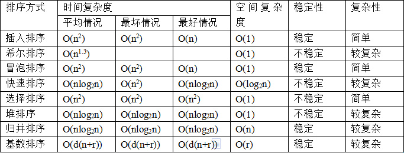

校招面试题

---

## 常用排序算法稳定性、时间复杂度分析



#### 各种排序算法稳定性分析

现在分析一下常见的排序算法的稳定性，每个都给出简单的理由。 

1. 冒泡排序 

	冒泡排序就是把小的元素往前调（或者把大的元素往后调）。注意是相邻的两个元素进行比较，而且是否需要交换也发生在这两个元素之间。
	
	所以，如果两个元素相等，我想你是不会再无聊地把它们俩再交换一下。
	
	如果两个相等的元素没有相邻，那么即使通过前面的两两交换把两个元素相邻起来，最终也不会交换它俩的位置，所以相同元素经过排序后顺序并没有改变。
	
	所以冒泡排序是一种稳定排序算法。 

2. 选择排序

	选择排序即是给每个位置选择待排序元素中当前最小的元素。比如给第一个位置选择最小的，在剩余元素里面给第二个位置选择次小的，
	
	依次类推，直到第n-1个元素，第n个元素不用选择了，因为只剩下它一个最大的元素了。
	
	那么，在一趟选择时，如果当前锁定元素比后面一个元素大，而后面较小的那个元素又出现在一个与当前锁定元素相等的元素后面，那么交换后位置顺序显然改变了。
	
	呵呵！比较拗口，举个例子：序列5 8 5 2 9， 我们知道第一趟选择第1个元素5会与2进行交换，那么原序列中两个5的相对先后顺序也就被破坏了。
	
	所以选择排序不是一个稳定的排序算法。 

3. 插入排序

	插入排序是在一个已经有序的小序列的基础上，一次插入一个元素。当然，刚开始这个有序的小序列只有1个元素，也就是第一个元素（默认它有序）。
	
	比较是从有序序列的末尾开始，也就是把待插入的元素和已经有序的最大者开始比起，如果比它大则直接插入在其后面。
	
	否则一直往前找直到找到它该插入的位置。如果遇见一个与插入元素相等的，那么把待插入的元素放在相等元素的后面。
	
	所以，相等元素的前后顺序没有改变，从原无序序列出去的顺序仍是排好序后的顺序，所以插入排序是稳定的。 

4. 快速排序

	快速排序有两个方向，左边的i下标一直往右走（当条件a[i] <= a[center_index]时），其中center_index是中枢元素的数组下标，一般取为数组第0个元素。
	
	而右边的j下标一直往左走（当a[j] > a[center_index]时）。
	
	如果i和j都走不动了，i <= j, 交换a[i]和a[j],重复上面的过程，直到i>j。交换a[j]和a[center_index]，完成一趟快速排序。
	
	在中枢元素和a[j]交换的时候，很有可能把前面的元素的稳定性打乱，比如序列为 5 3 3 4 3 8 9 10 11 
	
	现在中枢元素5和3(第5个元素，下标从1开始计)交换就会把元素3的稳定性打乱。
	
	所以快速排序是一个不稳定的排序算法，不稳定发生在中枢元素和a[j]交换的时刻。 

5. 归并排序

	归并排序是把序列递归地分成短序列，递归出口是短序列只有1个元素(认为直接有序)或者2个序列(1次比较和交换)，
	
	然后把各个有序的段序列合并成一个有序的长序列，不断合并直到原序列全部排好序。
	
	可以发现，在1个或2个元素时，1个元素不会交换，2个元素如果大小相等也没有人故意交换，这不会破坏稳定性。
	
	那么，在短的有序序列合并的过程中，稳定是是否受到破坏？
	
	没有，合并过程中我们可以保证如果两个当前元素相等时，我们把处在前面的序列的元素保存在结果序列的前面，这样就保证了稳定性。
	
	所以，归并排序也是稳定的排序算法。 

6. 基数排序

	基数排序是按照低位先排序，然后收集；再按照高位排序，然后再收集；依次类推，直到最高位。
	
	有时候有些属性是有优先级顺序的，先按低优先级排序，再按高优先级排序，最后的次序结果就是高优先级高的在前，高优先级相同的情况下低优先级高的在前。
	
	基数排序基于分别排序，分别收集，所以其是稳定的排序算法。

7. 希尔排序

	希尔排序是按照不同步长对元素进行插入排序，当刚开始元素很无序的时候，步长最大，所以插入排序的元素个数很少，速度很快；
	
	当元素基本有序时，步长很小，插入排序对于有序的序列效率很高。所以，希尔排序的时间复杂度会比O(N^2)好一些。
	
	由于多次插入排序，我们知道一次插入排序是稳定的，不会改变相同元素的相对顺序，
	
	但在不同的插入排序过程中，相同的元素可能在各自的插入排序中移动，最后其稳定性就会被打乱。
	
	所以shell排序是不稳定的排序算法。 

8. 堆排序

	我们知道堆的结构是节点i的孩子为2*i和2*i+1节点，大顶堆要求父节点大于等于其2个子节点，小顶堆要求父节点小于等于其2个子节点。
	
	在一个长为n的序列，堆排序的过程是从第n/2开始和其子节点共3个值选择最大（大顶堆）或者最小（小顶堆），这3个元素之间的选择当然不会破坏稳定性。
	
	但当为n/2-1, n/2-2, ...1这些个父节点选择元素时，就会破坏稳定性。
	
	有可能第n/2个父节点交换把后面一个元素交换过去了，而第n/2-1个父节点把后面一个相同的元素没有交换，那么这2个相同的元素之间的稳定性就被破坏了。

	所以，堆排序不是稳定的排序算法。


### 快速排序

快速排序一听名字就觉得很高端，在实际应用当中快速排序确实也是表现最好的排序算法。冒泡排序虽然高端，但其实其思想是来自冒泡排序，冒泡排序是通过相邻元素的比较和交换把最小的冒泡到最顶端，而快速排序是比较和交换小数和大数，这样一来不仅把小数冒泡到上面同时也把大数沉到下面。

举个栗子：对5,3,8,6,4这个无序序列进行快速排序，思路是右指针找比基准数小的，左指针找比基准数大的，交换之。

5,3,8,6,4 用5作为比较的基准，最终会把5小的移动到5的左边，比5大的移动到5的右边。

5,3,8,6,4 首先设置i,j两个指针分别指向两端，j指针先扫描（思考一下为什么？）4比5小停止。然后i扫描，8比5大停止。交换i,j位置。

5,3,4,6,8 然后j指针再扫描，这时j扫描4时两指针相遇。停止。然后交换4和基准数。

4,3,5,6,8 一次划分后达到了左边比5小，右边比5大的目的。之后对左右子序列递归排序，最终得到有序序列。

上面留下来了一个问题为什么一定要j指针先动呢？首先这也不是绝对的，这取决于基准数的位置，因为在最后两个指针相遇的时候，要交换基准数到相遇的位置。一般选取第一个数作为基准数，那么就是在左边，所以最后相遇的数要和基准数交换，那么相遇的数一定要比基准数小。所以j指针先移动才能先找到比基准数小的数。

快速排序是不稳定的，其时间平均时间复杂度是O(nlgn)。

实现代码：

```
public class QuickSort {
    //一次划分
    public static int partition(int[] arr, int left, int right) {
        int pivotKey = arr[left];
        int pivotPointer = left;
    while(left &lt; right) {
        while(left &lt; right &amp;&amp; arr[right] &gt;= pivotKey)
            right --;
        while(left &lt; right &amp;&amp; arr[left] &lt;= pivotKey)
            left ++;
        swap(arr, left, right); //把大的交换到右边，把小的交换到左边。
    }
    swap(arr, pivotPointer, left); //最后把pivot交换到中间
    return left;
}

public static void quickSort(int[] arr, int left, int right) {
    if(left &gt;= right)
        return ;
    int pivotPos = partition(arr, left, right);
    quickSort(arr, left, pivotPos-1);
    quickSort(arr, pivotPos+1, right);
}

public static void sort(int[] arr) {
    if(arr == null || arr.length == 0)
        return ;
    quickSort(arr, 0, arr.length-1);
}

public static void swap(int[] arr, int left, int right) {
    int temp = arr[left];
    arr[left] = arr[right];
    arr[right] = temp;
}

}
```

其实上面的代码还可以再优化，上面代码中基准数已经在pivotKey中保存了，所以不需要每次交换都设置一个temp变量，在交换左右指针的时候只需要先后覆盖就可以了。这样既能减少空间的使用还能降低赋值运算的次数。优化代码如下：

```
public class QuickSort {
/**
 * 划分
 * @param arr
 * @param left
 * @param right
 * @return
 */
public static int partition(int[] arr, int left, int right) {
    int pivotKey = arr[left];

    while(left &lt; right) {
        while(left &lt; right &amp;&amp; arr[right] &gt;= pivotKey)
            right --;
        arr[left] = arr[right]; //把小的移动到左边
        while(left &lt; right &amp;&amp; arr[left] &lt;= pivotKey)
            left ++;
        arr[right] = arr[left]; //把大的移动到右边
    }
    arr[left] = pivotKey; //最后把pivot赋值到中间
    return left;
}

/**
 * 递归划分子序列
 * @param arr
 * @param left
 * @param right
 */
public static void quickSort(int[] arr, int left, int right) {
    if(left &gt;= right)
        return ;
    int pivotPos = partition(arr, left, right);
    quickSort(arr, left, pivotPos-1);
    quickSort(arr, pivotPos+1, right);
}

public static void sort(int[] arr) {
    if(arr == null || arr.length == 0)
        return ;
    quickSort(arr, 0, arr.length-1);
}

}
```

总结快速排序的思想：冒泡+二分+递归分治，慢慢体会。。。
