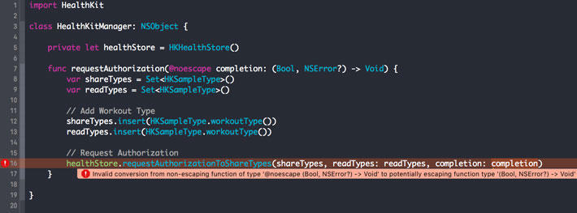
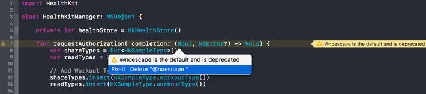
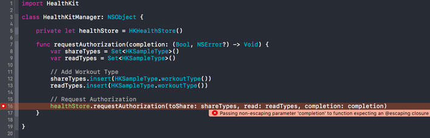

开始用swift语言是很容易的，而且它确实是一门很吸引人的语言。但是随着你频繁的使用，你会逐渐接触到swift更加复杂的结构.

在swift2中，你可能遇到过@noescape属性，你有没有花一点时间去理解它的意思？在swift3.0中，@noescape已经被移除了。为什么会这样？为什么swift3.0会引入@escaping？回答这些问题将成为这篇文章的主题。

### @noescape的含义

即使@noescape在swift3.0中已经被废弃了，但是对于理解它的含义依然有用。为什么呢？很简单，在swift3.0中@noescape被用作一个默认值，让我们开始进一步研究吧。

### 什么是逃逸闭包（Escaping Closure）

首先你需要理解什么是逃逸闭包。它的定义非常简单而且易于理解。如果一个闭包被作为一个参数传递给一个函数，并且在函数return之后才被唤起执行，那么这个闭包是逃逸闭包。并且这个闭包的参数是可以“逃出”这个函数体外的。理解了这个定义，这个逃逸闭包是不是就很好理解了呢？

```
If a closure is passed as an argument to a function and it is invoked after the function returns, the closure is escaping.
```

在swift2中，你可以标记一个函数参数@noescape属性，来告诉编译器传递给这个函数的闭包不允许“逃逸”出函数体外，让我们看一下下面的例子，注意这是用swift2写的。

```
import HealthKit

class HealthKitManager: NSObject {

    private let healthStore = HKHealthStore()

    func requestAuthorization(completion: (Bool, NSError?) -> Void) {
        var shareTypes = Set<HKSampleType>()
        var readTypes = Set<HKSampleType>()

        // Add Workout Type
        shareTypes.insert(HKSampleType.workoutType())
        readTypes.insert(HKSampleType.workoutType())

        // Request Authorization
        healthStore.requestAuthorizationToShareTypes(shareTypes, readTypes: readTypes,completion: completion)
    }

}
```

可以看到`requestAuthorization(_:)`方法接收了一个参数：一个闭包。在swift2中，闭包默认是可以“逃逸”到函数体外的，这就是为什么上面的例子没有报编译错误。注意completion作为一个参数传递给HKHealthStore 的`requestAuthorizationToShareTypes(_:readTypes:completion:)`方法，这个方法是异步的，也就是说这个闭包会在`requestAuthorization(_:)`函数return之后执行。换句话说，我们传给`requestAuthorization(_:)`的这个闭包逃逸了，它已经逃逸出了这个函数体。

如果我们给`requestAuthorization(_:)`函数参数添加一个`@noescape`属性会变得非常有趣，下面是添加`@noescape`属性的例子

```
import HealthKit

class HealthKitManager: NSObject {

    private let healthStore = HKHealthStore()

    func requestAuthorization(@noescape completion: (Bool, NSError?) -> Void) {
        var shareTypes = Set<HKSampleType>()
        var readTypes = Set<HKSampleType>()

        // Add Workout Type
        shareTypes.insert(HKSampleType.workoutType())
        readTypes.insert(HKSampleType.workoutType())

        // Request Authorization
        healthStore.requestAuthorizationToShareTypes(shareTypes, readTypes: readTypes,completion: completion)
    }
}
```

我们直接告诉编译器这个`completion`参数不能逃逸出函数体外，结果就是编译报错，并解释了是什么错误



### swift3.0

下面给出上面例子的swift3版本。这个例子会展示“逃逸闭包”在swift3.0会有什么变化。

```
import HealthKit

class HealthKitManager: NSObject {

    private let healthStore = HKHealthStore()

    func requestAuthorization(@noescape completion: (Bool, Error?) -> Void) {
        var shareTypes = Set<HKSampleType>()
        var readTypes = Set<HKSampleType>()

        // Add Workout Type
        shareTypes.insert(HKSampleType.workoutType())
        readTypes.insert(HKSampleType.workoutType())

        // Request Authorization
        healthStore.requestAuthorization(toShare: shareTypes, read: readTypes, completion: completion)
    }

}
```

编译器立即告诉我们`@noescape`在swift3中是默认的并且建议移除`@noescape`。事实上，`@noescape`在swift3中已经被废弃，你以后都不会用到它了。



因为我们传递给`requestAuthorization(completion:)`（注意这个方法签名在swift3变得不一样了）函数的闭包逃逸了，所以我们需要标记这个参数escaping.我们使用一个新的属性`@escaping`。这是SE-0103的直接结果，一个swift的进化理论提出默认创建不可逃逸的闭包。这是一个非常受欢迎的改变如果你问我的话。

```
import HealthKit

class HealthKitManager: NSObject {

    private let healthStore = HKHealthStore()

    func requestAuthorization(completion: @escaping (Bool, Error?) -> Void) {
        var shareTypes = Set<HKSampleType>()
        var readTypes = Set<HKSampleType>()

        // Add Workout Type
        shareTypes.insert(HKSampleType.workoutType())
        readTypes.insert(HKSampleType.workoutType())

        // Request Authorization
        healthStore.requestAuthorization(toShare: shareTypes, read: readTypes, completion: completion)
    }

}
```



你可能注意到了，这个@escaping属性写在参数类型的前面而不是参数名称的前面。这是swift3里一个新的点。

### @escaping的含义

这个提醒我们去理解@escaping属性的含义。因为在swift3中闭包默认是不可逃逸的，逃逸闭包需要像这样被标记。@escaping属性让我们可以那样做。

我们通过@escaping属性标记闭包，编译错误就消失了。

### 重点

这里几点关于创建默认不可逃逸闭包的好处： 最明显的好处就是编译器优化你的代码的性能和能力。如果编译器知道这个闭包是不可逃逸的，它可以关注内存管理的关键细节。

而且你可以在不可逃逸闭包里放心的使用self关键字，因为这个闭包总是在函数return之前执行，你不需要去使用一个弱引用去引用self.这对你而言是一个非常nice的功能。

作者：yydev
链接：http://www.jianshu.com/p/73bd0633ab00
來源：简书
著作权归作者所有。商业转载请联系作者获得授权，非商业转载请注明出处。