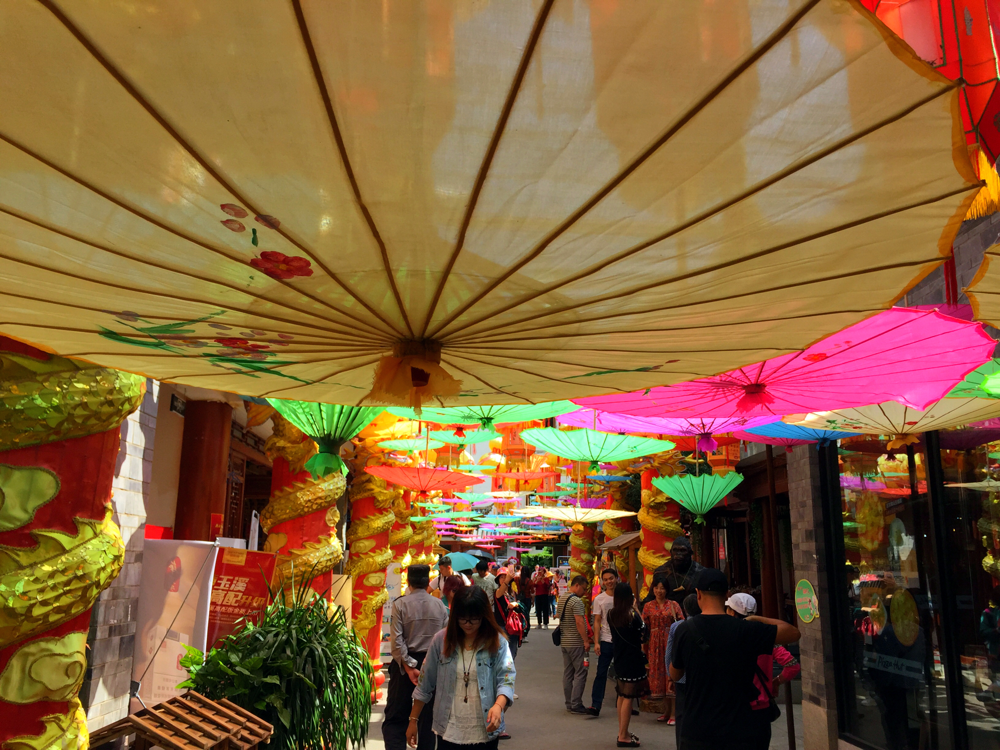
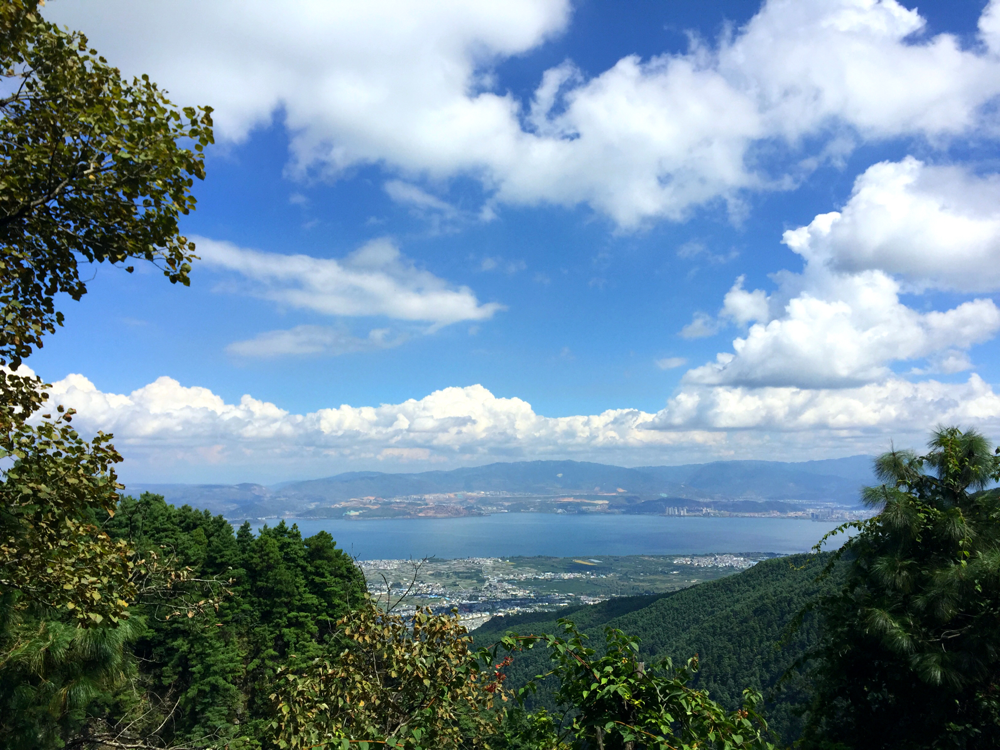
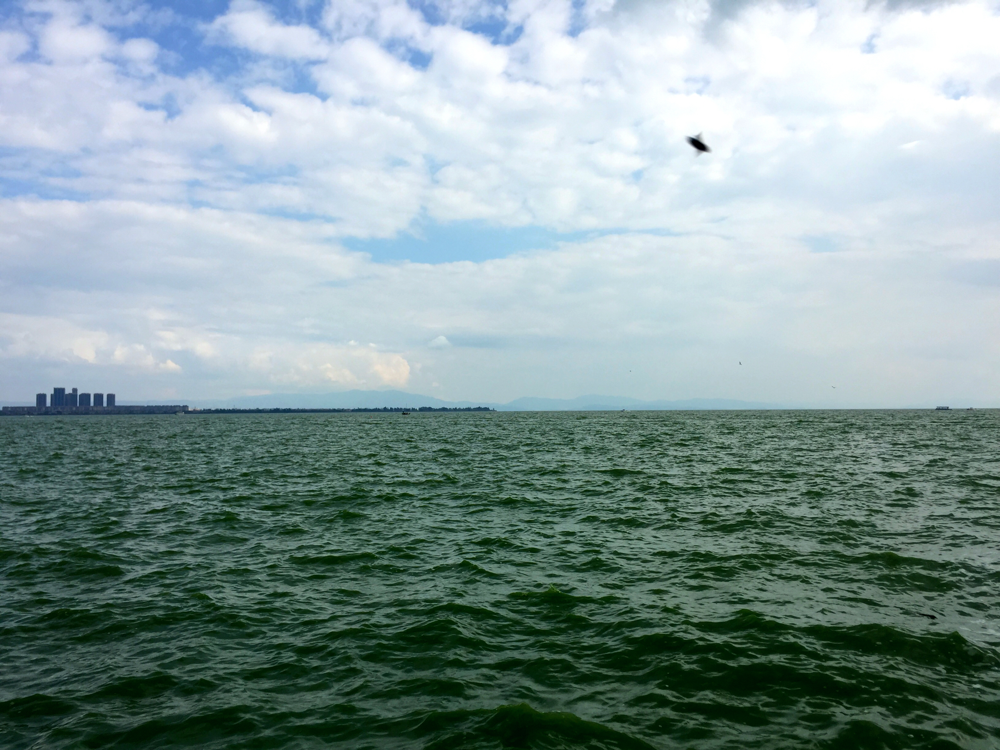

由于我是一个人跑到云南，人生地不熟，为了安全，又懒得自己规划形成，安排住宿出行，所以出发前，在飞猪上购买了昆明出发的7日纯玩游。

行程时间：10/1~10/8

出发地点：昆明

行程路线：**昆明 -> 丽江 -> 香格里拉 -> 丽江 -> 大理 -> 昆明**

---

### 丽江

- 1号下午抵达昆明
- 交通方式：昆明->丽江 火车卧铺
	- 昆明火车站晚上10点左右上车，睡一觉，早上7点多到达丽江，既充分利用夜间时间，又不耽误休息，一觉睡醒就可以开始玩耍了。
- 丽江交通：乘坐商务7座车 
- 住宿：建议入住丽江古城附近的酒店
- 游玩时间：2号整天
- 景点：
	- 玉湖村（上午）
		- 位于玉龙雪山脚下，号称雪山第一村
		- 进入玉湖村一定要购票，260~360元，包含骑马项目等
		- 个人觉得不值这个票价，所以没有购票进入，只在门口转了转，太无聊
	- 玉龙雪山（下午）
		- 海拔最高5596米
		- 登山有两个选择，大索道和小索道
			- 大索道可以上到最高4000+的位置，一览众山小，大索道每天限流，所以一定要提前预约
			- 小索道登上的是旁边的另一座山峰，登顶之后只能仰视最高峰，风景很一般
			- 如果登大索道的话，有高反的人可以带瓶氧气，去雪山前购买会便宜很多，普通便利店10~20元
		- 玉龙雪山下有甘海子、白水河、蓝月谷（号称小九寨），可以购买60元的电瓶车票，时间充裕喜欢走路的人，也可以自行徒步。
	- 丽江市区（晚上）
		- 先去中国丽江（国际）民族文化交流中心看了场《丽水金沙》大型民族歌舞表演，整体来说还比较走心
		- 然后步行至丽江古城内，酒吧一条街
- 自助游：建议去玉龙雪山，登大索道，下来后游览甘海子、白水河、蓝月谷，然后返回丽江市区，去丽江古城找个酒吧，静静的听听歌，喝喝酒。一天时间也很充裕
- po图
	- 甘海子
		- 
		- 
		- 
	- 玉龙雪山小索道登顶，对面就是大索道上的山峰了，所以一定要提前约大索道
		- 
	- 白水河&蓝月谷
		- 
		- 
		- 
		- 
		- 
	- 酒吧一条街
		- 

---

### 香格里拉

- 3号早上从丽江坐大巴出发前往香格里拉，离天堂最近的地方
- 沿滇藏公路一直前行，抵达【长江第一湾】虎跳峡
- 乘车继续前行抵达香格里拉县城后用餐，之后乘车前往游览茶马古道重镇之一“香格里拉古城”【独克宗月光古城】，独克宗月光古城拥有世界上最大的转经筒，也可顺路去下香巴拉时轮坛城，更深入的了解藏族文化
- 晚上藏民家访【土司宴】，听歌赏舞，还是比较走心的，尤其是一位60+岁的老奶奶高唱了一首，嘹亮的声音直击内心深处

- po图
	- 虎跳峡
		- 
		- 
		- 

	- 独克宗月光古城
		- 
		- 
		- 
		- 

	- 香巴拉时轮坛城
		- 
		- 
	
	- 土司宴
		- 
		- 

--- 

### 普达措

- 4号早上从香格里拉出发前往普达措国家森林公园，主要游玩属都湖和碧塔海，但由于近期碧塔海生态整治，暂时关闭了，只去了属都湖，无奈天气不好，没有看到想象中的烟雾缭绕，比较遗憾
- 下午基本就开始乘大巴车返程，回到丽江，晚上6点左右到丽江，可以趁晚上这几个小时再到丽江古城找个安静的酒吧，听听歌

- po 图
	- 属都湖
		- 
		- 
		- 
		- 
		- 

--- 

### 大理

- 5号早晨从丽江出发前往大理。看下大理的地图，背靠苍山，面临洱海，320国道开上几个小时就可以到达中缅边境
- 首先去了蝴蝶泉公园，了解白族文化，虽然不在蝴蝶的正季，但是也能看到不少蝴蝶，还有各种各样的蝴蝶标本
- 下午乘邮轮游洱海，游轮上有白族的三道茶文化体验
- 邮轮的终点是南诏风情岛，沿途欣赏双廊，洱海风光，双廊目前因为政治污染，商业迁出，暂时全部关闭，已成鬼城，只能远远的看一看
- 洱海结束后去崇圣寺三塔，寺内要买电动车票，可以节省不少时间
- 晚上入住大理

- po 图

	- 蝴蝶泉
		- 
		- 
		- 
		- 
		- 
	- 洱海&南诏风情岛
		- 
		- 
		- 
		- 
		- 
	- 崇圣寺三塔
		- 
		- 
		- 

--- 

- 6号早上早餐后游览大理古城，天下古城一个样，吃下各种小吃，赵记梅子可以带一点作为伴手礼，尝一尝杨记乳扇，吃不腻的烤火腿。古城商业化气息很浓，不懂的话就不要买银器或玉器了。大理和腾冲是著名的玉石加工地，A货是纯天然的，B货浸泡过的残次品。
- 中餐后游览苍山
- 下午可以乘火车返回昆明，睡一觉7号早上达到昆明，也可以坐大巴车回昆明，下午4点出发，晚上9点左右就可以到昆明
- po图
	- 大理古城
		- 
		- 
		- 
	- 苍山
		- 
		- 
		- 

--- 

### 昆明

- 7号早上去趟昆明大学，国内号称最美的大学之一，不大
- 下午去滇池、西山，滇池污染真心严重，水是绿的，船开过，水上泛起一层白色泡沫，细看总能找到飘在水面的死鱼，滇池边有很多红嘴鸥，每年10月初迁徙过来
- 大学旁边有一条小吃街，物价良心。旁边还有个动物园，进去转了一圈，看到了草泥马
- 强烈推荐小吃：越南清池小卷粉
- 昆明可以带点嘉华鲜花饼作为伴手礼

- po 图
	- 滇池
		- 
		- 
		- 
		- 
		- 
		- 
		- 
		- 

--- 

### 从昆明返程