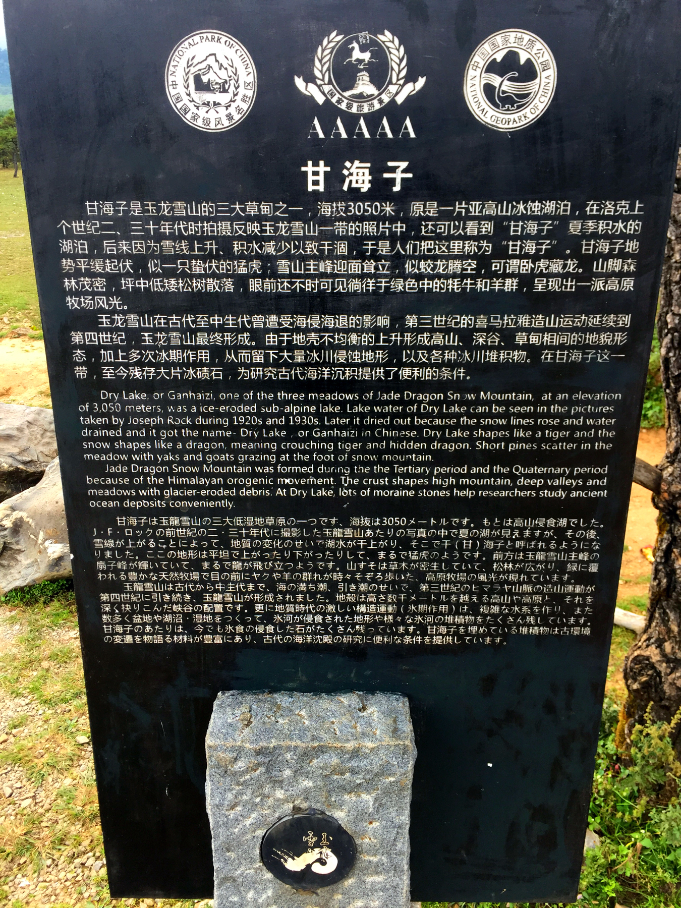

由于我是一个人跑到云南，人生地不熟，为了安全，又懒得自己规划形成，安排住宿出行，所以出发前，在飞猪上购买了昆明出发的7日纯玩游。

行程时间：10/1~10/8

出发地点：昆明

行程路线：**昆明 -> 丽江 -> 香格里拉 -> 丽江 -> 大理 -> 昆明**

---

### 丽江

- 1号下午抵达昆明
- 交通方式：昆明->丽江 火车卧铺
	- 昆明火车站晚上10点左右上车，睡一觉，早上7点多到达丽江，既充分利用夜间时间，又不耽误休息，一觉睡醒就可以开始玩耍了。
- 丽江交通：乘坐商务7座车 
- 住宿：建议入住丽江古城附近的酒店
- 游玩时间：2号整天
- 景点：
	- 玉湖村（上午）
		- 位于玉龙雪山脚下，号称雪山第一村
		- 进入玉湖村一定要购票，260~360元，包含骑马项目等
		- 个人觉得不值这个票价，所以没有购票进入，只在门口转了转，太无聊
	- 玉龙雪山（下午）
		- 海拔最高5596米
		- 登山有两个选择，大索道和小索道
			- 大索道可以上到最高4000+的位置，一览众山小，大索道每天限流，所以一定要提前预约
			- 小索道登上的是旁边的另一座山峰，登顶之后只能仰视最高峰，风景很一般
			- 如果登大索道的话，有高反的人可以带瓶氧气，去雪山前购买会便宜很多，普通便利店10~20元
		- 玉龙雪山下有甘海子、白水河、蓝月谷（号称小九寨），可以购买60元的电瓶车票，时间充裕喜欢走路的人，也可以自行徒步。
	- 丽江市区（晚上）
		- 先去中国丽江（国际）民族文化交流中心看了场《丽水金沙》大型民族歌舞表演，整体来说还比较走心
		- 然后步行至丽江古城内，酒吧一条街
- 自助游：建议去玉龙雪山，登大索道，下来后游览甘海子、白水河、蓝月谷，然后返回丽江市区，去丽江古城找个酒吧，静静的听听歌，喝喝酒。一天时间也很充裕
- po图
	- 甘海子
		- 
		- 
		- 
	- 玉龙雪山小索道登顶，对面就是大索道上的山峰了，所以一定要提前约大索道
		- 
	- 白水河&蓝月谷
		- 
		- 
		- 
		- 
		- 
	- 酒吧一条街
		- 

---

### 香格里拉

- 3号早上从丽江坐大巴出发前往香格里拉，离天堂最近的地方

