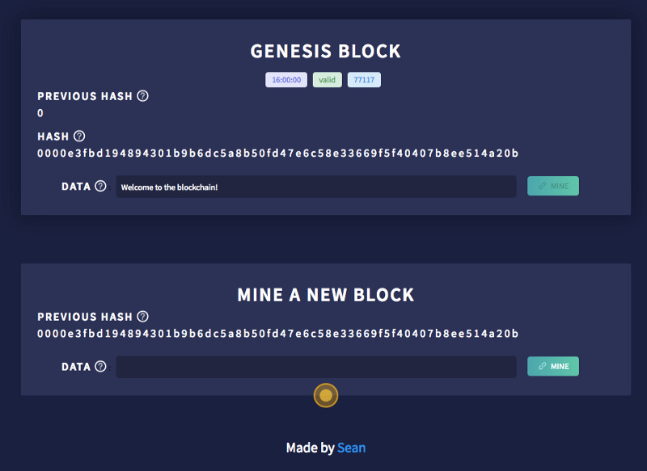
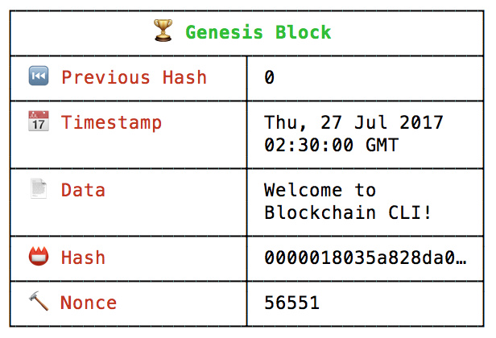

[本文转载自Jobbole](http://blog.jobbole.com/112551/)

---

维基百科上对区块链的描述：

	维护不断增长的记录（称作区块）的分布式数据库。

听上去很简单，但到底是怎么回事呢？

我们用一款开源命令行界面 [Blockchain CLI](https://github.com/seanseany/blockchain-cli) 来详细说明区块链。我也做了一个[浏览器可以访问的在线版](http://blockchaindemo.io/)。



---

### 安装命令行界面

首先请确保安装 Node.js

然后在终端里运行下面命令：

```
npm install blockchain-cli -g
blockchain
```

你将看到 👋 Welcome to Blockchain CLI! 和 blockchain 提示已准备好接受命令。

### 区块是什么样子的？

你可以在命令行中输入 blockchain 或 bc 来查看你当前的区块链。你将看到下图类似的区块。



- 索引（区块）：这是哪个区块？（初始区块索引为 0）
- 哈希：区块有效吗？
- 前个哈希：之前一个区块有效吗？
- 时间戳：区块什么时候添加的？
- 数据：区块中存的什么信息？
- 随机数（Nonce）：我们重复了多少次才找到有效的区块？

### 初始区块

每个区块链都会以一个 🏆 Genesis Block 作为开始。你接下来将会看到每个区块都关联前一个区块。所以我们开采第一个区块前，要有初始区块。

### 当一个新的区块被开采出来会发生什么？

让我们来开采我们的第一个区块，在提示框输入 mine freeCodeCamp♥︎ 命令。 区块链根据最后一个区块生成当前索引和前个哈希。我们现在的区块链最后一个区块就是初始区块。

- 索引：o+1 = 1
- 前个哈希：0000018035a828da0…
- 时间戳：区块什么时候添加的？
- 数据：freeCodeCamp
- 哈希：??
- 随机数（Nonce)：??

### 哈希值如何计算

哈希值是固定长度的数值，用来标识唯一数据。

哈希通过将索引、前个哈希、时间戳、数据、随机数作为输入后计算得出。

```
CryptoJS.SHA256(index + previousHash + timestamp + data + nonce)
```
SHA256 算法通过给定的输入，计算出一个唯一的哈希。相同的输入总会生成相同的哈希。

### 你注意到哈希开头的四个 0 了吗？

开头的四个 0 是有效哈希的基本要求。开头 0 的个数被称为难度值（difficulty）。

```
function isValidHashDifficulty(hash, difficulty) {
  for (var i = 0, b = hash.length; i < b; i ++) {
      if (hash[i] !== '0') {
          break;
      }
  }
  return i >= difficulty;
}
```

这就是众所周知的工作量证明系统（Proof-of-Work）。

### 什么是随机数？

随机数是用来寻找有效哈希的一个数字。

```
let nonce = 0;
let hash;
let input;
while(!isValidHashDifficulty(hash)) {     
  nonce = nonce + 1;
  input = index + previousHash + timestamp + data + nonce;
  hash = CryptoJS.SHA256(input)
}
```

随机数不断迭代，直到哈希有效。在我们的例子中，有效的哈希值至少要四个 0 开头。寻找有效哈希对应随机数的过程就称为开采（挖矿）。

随着难度值的提升，有效哈希的数量逐步减少，我们需要投入更多资源来找到一个有效哈希。

### 为什么这很重要？

因为它确保了区块链不可变。

如果我们有一个这样的区块链 A → B → C，有人想修改区块 A 上的数据。会发生下面情况：

1. 修改区块 A 上的数据。
2. 区块 A 的哈希变动，因为计算哈希所用的数据变化了。
3. 区块 A 无效，因为它的哈希不是四个 0 开头。
4. 区块 B 的哈希变动，因为计算区块 B 的哈希所用到的区块 A 的哈希值变化了。
5. 区块 B 无效，因为它的哈希不是四个 0 开头。
6. 区块 C 的哈希变动，因为计算区块 C 的哈希所用到的区块 B 的哈希值变化了。
7. 区块 C 无效，因为它的哈希不是四个 0 开头。

修改一个区块的唯一方式就是重新开采这个区块以及它之后的所有区块。因为新的区块不断增加，基本不可能修改区块链。
