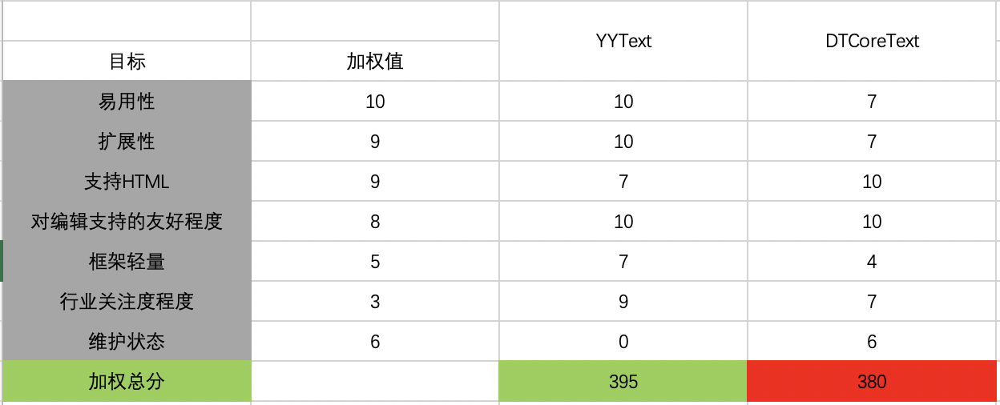

[TOC]

## 一、背景

【富途牛牛iOS-牛牛圈】当前富文本实现为DTCoreText方案，存在以下问题：

1. 牛牛圈纯显示使用的UITextView，实现方式过重，且使用不便；
2. 扩展不便，行情内的富文本实现目前都是自行采用较原始的方案解决，实现笨重繁琐；
3. 牛牛拉下来了DTCoreText的源码，进行了二次开发，与业务进行了耦合，导致官方的后期bug修复无法合并到牛牛中的DTCoreText，本质上失去了维护状态，导致iOS系统更新后，偶现相关bug，无法修复。

鉴于以上问题，现决定重新搞一套富文本实现方案，考虑到自己实现一套复杂度较高，决定引入行业内较优秀的第三库作为替代方案首要解决展示问题，其次再根据需求评估是否需要替换掉编辑的实现方案。

## 二、业内关注度较高的富文本实现方案

- [YYText](https://github.com/ibireme/YYText)（8031）

  > Powerful text framework for iOS to display and edit rich text.

- [TYAttributedLabel](https://github.com/12207480/TYAttributedLabel)（2685）

  > TYAttributedLabel 简单，强大的属性文本控件(无需了解CoreText)，支持图文混排显示，支持添加链接，image和UIView控件，支持自定义排版显示

- [TTTAttributedLabel](https://github.com/TTTAttributedLabel/TTTAttributedLabel)（8479）

  > A drop-in replacement for UILabel that supports attributes, data detectors, links, and more

- [DTCoreText](https://github.com/Cocoanetics/DTCoreText)（5805）

  > Methods to allow using HTML code with CoreText

- [OHAttributedLabel](https://github.com/AliSoftware/OHAttributedLabel)（1549）

  > UILabel that supports NSAttributedString

- [RTLabel](https://github.com/honcheng/RTLabel)（1454）

  > simple rich text display for iOS using html-like markups [http://honcheng.com](http://honcheng.com/)

考虑到`OHAttributedLabel`与`TTTAttributedLabel`功能相似度较高，同时关注度相对较低，并且长期处于无人维护的状态，所以暂不推荐使用，不列入对比范围。

|              |                            YYText                            |          TYAttributedLabel           |   DTCoreText   | TTTAttributedLabel |  RTLabel   |
| :----------: | :----------------------------------------------------------: | :----------------------------------: | :------------: | :----------------: | :--------: |
|   star数量   |                             8031                             |                 2685                 |      5805      |        8479        |    1454    |
| 上次代码提交 |                            17/8/6                            |               18/6/28                |     19/7/1     |      17/1/12       |  17/5/23   |
| 是否支持编辑 |                              Y                               |                  N                   |       Y        |         N          |     N      |
|    扩展性    |                              优                              |                 优 -                 |       一般        |         差         |     差     |
|     性能     |                CoreText，支持异步渲染，优能优                |    CoreText，支持异步渲染，优能优    |    CoreText    |      CoreText      |  CoreText  |
|     特点     | yytextview 可以输入文本，插入图片，表情，并且能够实时布局，非常强大，支持横屏 | 更侧重于数据展示排版，不支持交互编辑 | 对HTML支持最好 |     特别轻量，但不支持编辑     | 特别轻量，但不支持编辑 |
|   解析HTML   |                      N(需开发扩展实现)                       |          N(需开发扩展实现)    |       Y        |         N          |     Y      |
|   框架量级   |                             一般                             |                 一般                 |       重       |         轻         |     轻     |
|    易用性    |                              优                              |                  优                  |      一般      |        一般        |    一般    |

## 三、决策分析

### 必要目标

- 易用、扩展性强，支持HTML转换
- 未来可能会用来替换掉DTCoreText，解决长期无人维护的现状，所以需要支持编辑

### 想要目标

- 框架轻量
- 行业关注度高
- 有人维护

### 分析对比

基于必要目标的考虑：纳入考虑范围的为`YYText`与`DTCoreText`，然后进行科学决策，

所以决定采用引入`YYText`，并进行二次封装供牛牛使用