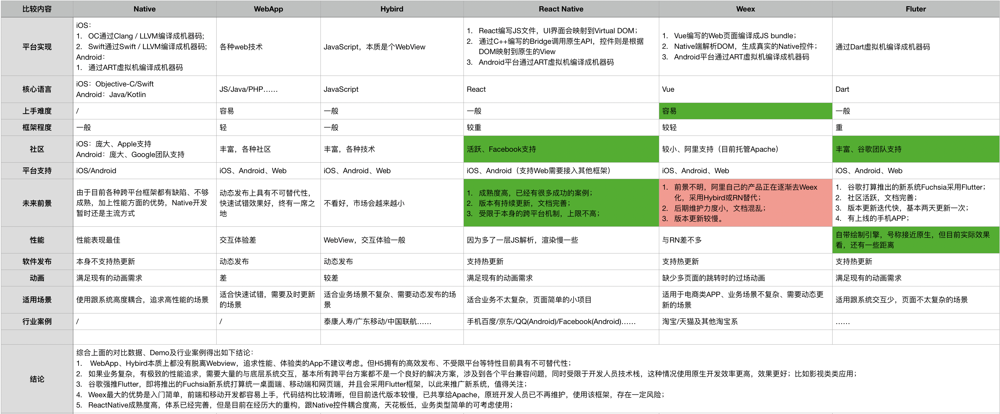

[TOC]

## 一、移动端开发方案简介

以下是移动端普通App相对主流的开发方案，还有一些野路子，就不列举上来了。

> 比如有人用cocos2dx这种游戏引擎开发普通应用App：
>
> 为什么说cocos2dx做App是野路子，游戏引擎和App的渲染更新有根本的区别，更耗电。同时cocos2dx相比缺少一些通用组件。

1. 原生
   1. iOS
   2. Android
2. WebApp
3. Hybrid
4. React Native
5. Weex
6. Flutter

---

### 原生

#### iOS

- 发展史
  - 2005年策划，把Mac变小或把iPod变大
  - 2007年1月9日 iPhone OS（iOS）面世
  - 2007年10月 Apple开发软件开发工具包
  - 2008年3月6日 推出iPhone SDK
  - 2008年6月10日 苹果发布iPhone 3G
  - 2008年7月10日 推出App Store，最初提供了500个APP
- iPhone SDK设计思路源自Mac
  - 第三方Mac开发人员以最少的再培训，进行iPhone App开发
  - UIKit 比 AppKit 更好用

#### Android

- 发展史
  - 2003年10月, 有“Android之父”之称的安迪·鲁宾等人共同成立了Android科技公司（Android Inc.）
  - 2005年7月11日 Google出于战略防御，抗衡微软的目的，收购Android公司
  - 2007年苹果推出iPhone，Android创始人安迪·鲁宾对原型机十分不满，使Android系统的设计重新回到绘图板
  - 2007年11月5日 成立开放手持设备联盟，HTC/Samsung/摩托罗拉/高通/Inter/LG等一大批厂商加入
  - 2008年9月23日 首款Android商业智能机HTC Dream问世
  - 2008年12月9日 新一批成员加入联盟，ARM/华为/索尼等

> **开放手持设备联盟**（英语：**O**pen **H**andset **A**lliance，简称**OHA**）是一个由手机制造商、软件开发商、半导体制造商、电信运营商等企业组成的商业联盟，目标是为[移动设备](https://zh.wikipedia.org/wiki/行動裝置)开发[开放标准](https://zh.wikipedia.org/wiki/开放标准)。

---

### WebApp

> iOS和Android相继问世后，WebApp概念顺势而起，随着H5标准的发布，WebApp得到了更快速的发展

- 一个触屏版的浏览器
  - 生存在浏览器里的应用，所以只能运行在浏览器里，宿主是浏览器，不再是操作系统。资源一般都在网络上
- 优点：易维护、更新；开发成本低
- 缺点：受制于浏览器的处理能力，与原生接口交互受限。交互体验差，白屏时间长

---

### Hybrid

> 为了解决WebApp 与原生接口交互受限。交互体验差，白屏时间长的问题，业界提出了Hybrid的开发理念
>
> Hybrid也叫混合开发，广义上讲，RN、weex也可以理解为混合开发。这里Hybrid从狭义上理解，可以理解为寄托在webview上的app，原生提供一个原生的壳子。
>
> Hybrid是个开发概念，市场上支持Hybrid开发的框架有很多，这些框架提供了与原生接口交互的能力，比如摇一摇、横竖屏、相机等

- 混合模式移动应用，介于WebApp与Native App两者之间的开发技术

  由Native通过JSBridge等方法提供统一的API，然后用Html5+JS来写实际的逻辑，调用API，这种模式下，由于Android、iOS的API一般有一致性，而且最终的页面也是在webview中显示，所以有跨平台效果

- 主流框架
  - Appcan
  - phonegap
  - Cordova
  - crossapp
  - wex5
  - apicloud
- 优点：开发和发布都比较方便，效率介于Native App、Web App之间
- 缺点：学习范围较广，需要原生配合

---

### React Native

- 诞生背景

  React框架是一个非常优雅、现代的前端开发框架，最早孵化与FB内部。之后由于H5与原生性能与体验上无法弥合的差距，12年9月放弃H5转向原生，15年3月正式发布了RN框架，9月发布了支持Android的RN框架

- 特性

  - 原生渲染，性能媲美原生应用
  - 开发效率高，js学习成本低、语法灵活
  - 组件化强且丰富
  - 节约开发成本，跨平台
  - 实时调试。开启实时重载，App会随着代码改动自动更新
  - 代码热部署
  - 社区活跃
  - 有效减低移动应用安装包体积（当原生App大于15M时）

---

### Weex

- 诞生背景

  阿里无线为了更好地解决移动端动态性问题，推出的一个相比RN更轻量的解决方案。与Vue结合，快速开发

  所谓动态性：即移动端的灵活性、迭代更新的周期和成本优化到极致

- 与RN的相同点

  - JS开发，实时调试
  - 代码热部署
  - 底层都是通过JSBridge方式，运行时桥接到原生组件进行渲染

- 与RN的不同点

  - Weex更轻量
  - RN生态更优，组件更丰富，坑相对少

> 极可能始于KPI，毕竟大厂造轮子来升级是非常好的途径之一。
>
> 16年12月Weex捐赠给了Apache，原班开发人员已不再维护，也基本上从侧面坐实了weex是个KPI项目。
>
> [Weex——关于移动端动态性的思考、实现和未来](https://www.infoq.cn/article/taobao-mobile-weex)

---

### Flutter

- 简介

  Google推出，理念是：轻松、快速地构建漂亮的移动应用；

  使用C、C ++、Dart和Skia（2D渲染引擎）构建；旨在帮助开发人员轻松实现恒定的60fps

  Flutter的历史最早可以追溯到2014年10月，其前身是Google内部孵化的Sky项目

- 特性

  - 使用自己的高性能渲染引擎
  - 亚秒级有状态的热重载
  - 丰富的Android和iOS套件，Flutter使用自己的高性能渲染引擎来绘制widget
  - 跨平台，1.2 支持web
  - 支持Android4.1以上，iOS8以上

- 使用Dart语言

  Dart运行时和编译器支持Flutter的两个关键特性的组合：基于JIT的快速开发周期，允许使用类型的语言进行形状更改和有状态的热重载；以及AOT编译器，可生成高效的ARM代码，可以快速启动并拥有可预测的生产部署性能。

  免去了RN、Weex运行时Js的解释过程和与原生接口的桥接过程，理论上效率一定是高效的。

  使用Dart根本原因是：开发时快速编译，允许热重载；同时编译打包出来的APP可以生成ARM代码，启动快。

- 其他

  同样的代码iOS出包比Android大， IPA 比 APK 更大的主要原因是苹果加密了 IPA 中的二进制文件

  支持Linux、Mac和Windows上的开发

---

## 二、移动端开发方案对比

分别从以下几点对各方案进行对比：

- 平台实现
- 核心语言
- 上手难度
- 框架程度
- 社区
- 平台支持
- 未来前景
- 性能
- 软件发布
- 动画
- 适用场景
- 行业案例

---

## 三、参考资料

- [iOS](https://zh.wikipedia.org/wiki/IOS)
- [Android](https://zh.wikipedia.org/wiki/Android)
- [React Native中文网](https://reactnative.cn/)
- [Weex——关于移动端动态性的思考、实现和未来](https://www.infoq.cn/article/taobao-mobile-weex)
- [Flutter中文网](https://flutterchina.club/faq/#介绍)
- [移动跨平台框架Flutter介绍和学习线路](https://segmentfault.com/a/1190000018526152)

